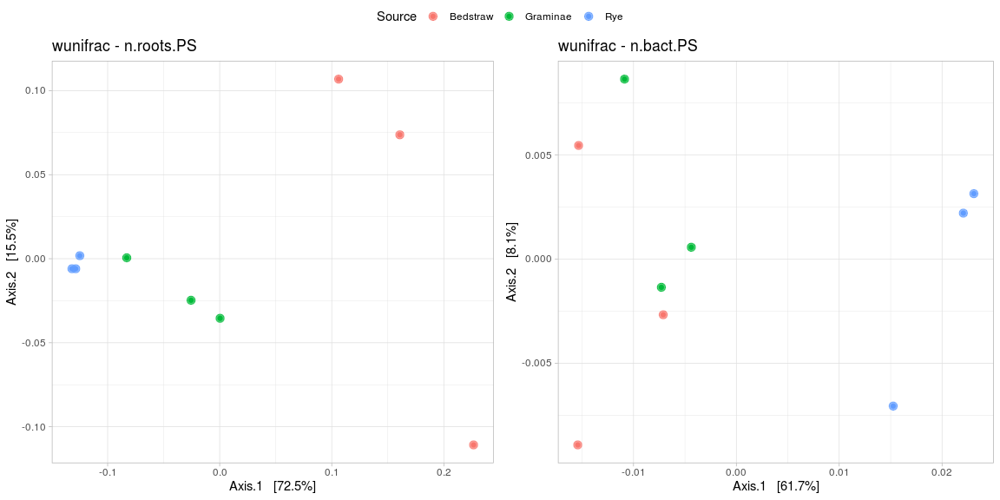

```r
library(phyloseq)
library(ggplot2)
library(dplyr)
library(ggpubr)
library(picante)
library(reshape2)
library(tidyr)
library(psych)
library(DESeq2)

setwd('/home/alexey/Analysis/RW/3rd publication/rhizofield/')
source('functions2.R')
```


```r
#Black soil
roots.BS <- readRDS('roots.BS.RData')
bact.BS <- readRDS('bact.BS.RData')  %>% subset_taxa(Family != "Mitochondria" & Class != "Chloroplast")

bact.BS <- subset_samples(bact.BS, Spot %in% c('1', '2', '3'))

n.roots.BS <- rarefy_collapse(roots.BS)
n.bact.BS <- rarefy_collapse(bact.BS)
```


```r
#Podzol soil
roots.PS <- readRDS('roots.PS.RData')
bact.PS <- readRDS('bact.PS.RData') %>% subset_taxa(Family != "Mitochondria" & Class != "Chloroplast")

bact.PS <- subset_samples(bact.PS, Spot %in% c('1', '2', '3'))

n.roots.PS <- rarefy_collapse(roots.PS)
n.bact.PS <- rarefy_collapse(bact.PS)
```

## Представленность таксонов

### Состав корневых сообществ

Как задать корректный порог? Или все же отдельные графики?


```r
a <- phyloseq(otu_table(n.roots.BS),
              tax_table(n.roots.BS),
              sam_data(n.roots.BS))
b <- phyloseq(otu_table(n.roots.PS),
              tax_table(n.roots.PS),
              sam_data(n.roots.PS))
c <- merge_phyloseq(a, b)

bargraph(c, "Genus", 0.1) + facet_grid(~Soil, scale = 'free_x')
```

<!-- -->

```r
ggarrange(bargraph(n.roots.BS, "Genus", 0.03),
          bargraph(n.roots.PS, "Genus", 0.03),
          ncol = 2)
```

<!-- -->

### Состав бактериальных сообществ


```r
a <- phyloseq(otu_table(n.bact.BS),
              tax_table(n.bact.BS),
              sam_data(n.bact.BS))
b <- phyloseq(otu_table(n.bact.PS),
              tax_table(n.bact.PS),
              sam_data(n.bact.PS))
c <- merge_phyloseq(a, b)

bargraph(c, "Phylum", 0.03) + facet_grid(~Soil, scale = 'free_x')
```

<!-- -->


## Альфа-разнообразие

**Гипотеза: богатство корневых сообществ определяет богатство сообществ бактерий**

Четыре метрики. Индексы **richness** у нас представляют количество видов **Observed** и сумма длин веток дерева **PD**. За индексы **eveness** будут выступать индекс Симпсона **Simpson** и взвешенная средняя дистанция между последовательностями **mpd**.
Каким образом эти экологические метрики сочетаются с более "сырыми" дистанциями **p-value**, и можем ли мы увидеть "отпечатки" растительных сообществ в сообществах микроорганизмов?
Давайте посчитаем корреляцию между этими индексами, рассчитанными для разных почв в парах "корни - бактерии"


### Графики корреляции метрик альфа-разнообразия


```r
plot_internal_correlation(alpha_div(n.roots.BS, pairwise_distances_from_ps(n.roots.BS)) %>% select(-Source, -Spot))
```

<!-- -->

```r
plot_internal_correlation(alpha_div(n.roots.PS, pairwise_distances_from_ps(n.roots.PS)) %>% select(-Source, -Spot))
```

<!-- -->

```r
plot_internal_correlation(alpha_div(n.bact.BS, pairwise_distances_from_ps(n.bact.BS)) %>% select(-Source, -Spot))
```

<!-- -->

```r
plot_internal_correlation(alpha_div(n.bact.PS, pairwise_distances_from_ps(n.bact.PS)) %>% select(-Source, -Spot))
```

<!-- -->

### 


```r
# Metrics
n.roots.BS.alpha <- bootstrapped_alpha_div(n.roots.BS)
n.roots.PS.alpha <- bootstrapped_alpha_div(n.roots.PS)
n.bact.BS.alpha <- bootstrapped_alpha_div(n.bact.BS)
n.bact.PS.alpha <- bootstrapped_alpha_div(n.bact.PS)

drawer <- function(metric){
  p1 <- plot_correlation(n.roots.BS.alpha, n.bact.BS.alpha, metric)
  p3 <- plot_correlation(n.roots.PS.alpha, n.bact.PS.alpha, metric)
  ggarrange(p1, p3, ncol = 2)
}

drawer('Observed')
```

<!-- -->

```r
drawer('PD')
```

<!-- -->

```r
drawer('Simpson')
```

<!-- -->

```r
drawer('mpd')
```

<!-- -->

```r
drawer('p.dist')
```

<!-- -->


Любопытно. Индекс p-value, по-видимому, чувствительнее всего отражают предполагаемую нами зависимость, но и классические экологические метрики, особенно метрики eveness, ее отражают. 
Вероятно, мы оказываемся на границе чувствительности, так как при очень схожем паттерне достоверность то есть, то нет. 

---


## Бета-разнообразие

**Гипотеза: богатство корневых сообществ определяет богатство сообществ бактерий и грибов**

### Бета-разнообразие


```r
beta_plot_drawer <- function(metric){
  p1 <- beta_plot(n.roots.PS, metric)
  p2 <- beta_plot(n.bact.PS, metric)
  p3 <- beta_plot(n.roots.BS, metric)
  p4 <- beta_plot(n.bact.BS, metric)
  
  ggarrange(ggarrange(p1, p2, common.legend = T, legend = 'bottom'),
            ggarrange(p3, p4, common.legend = T, legend = 'bottom'),
            nrow = 2)
}


beta_plot_drawer("unifrac")
```

<!-- -->

```r
beta_plot_drawer("wunifrac")
```

<!-- -->

```r
beta_plot_drawer("bray")
```

<!-- -->


### Корреляця дистанций бета-разнообразия

Каждая точка на графике - численное выражение дистанция между двумя сообществами (например, Graminae.1 - Rye.2). По оси Х эта дистанция взята для растительных сообществ, по оси Y - для сообществ микроорганизмов. Насколько распределение дистанций в корневых сообществах повторяет его в сообществах микроорганизмов?


```r
beta_drawer <- function(metric){
  p1 <- beta_corr(n.roots.BS, n.bact.BS, metric)
  p3 <- beta_corr(n.roots.PS, n.bact.PS, metric)
  ggarrange(p1, p3, ncol = 2)
}

beta_drawer('unifrac')
```

<!-- -->

```r
beta_drawer('wunifrac')
```

<!-- -->

```r
beta_drawer('bray')
```

<!-- -->


```r
# # Strange beta p-distance
# 
# all.beta.pd <- read.csv("beta_p-distance.csv", comment.char = "#", sep = "\t")
# 
# beta.pd.roots.BS <- all.beta.pd %>% filter(norm == 1, Source == "Roots", Soil == "BS")
# beta.pd.roots.PS <- all.beta.pd %>% filter(norm == 1, Source == "Roots", Soil == "PS")
# beta.pd.bact.BS <- all.beta.pd %>% filter(norm == 1, Source == "Bact", Soil == "BS")
# beta.pd.bact.PS <- all.beta.pd %>% filter(norm == 1, Source == "Bact", Soil == "PS")
# 
# convert_longer <- function(table_df){
#   table_df <- table_df  %>% 
#     select(-norm, -Source, -Soil)
#   colnames(table_df) <- c("X", as.character(table_df$X)) 
#   table_df %>%
#     pivot_longer(!X, names_to = "Y", values_to = "value")
# }
# 
# beta_p_distance_correlation <- function(root, bact){
#   a <- convert_longer(root)
#   b <- convert_longer(bact)
#   
#   data <- inner_join(a, b, by = c('X', 'Y'))
#   x = data$value.x
#   y = data$value.y
#   data$Color <- paste(gsub('.{2}$', '', data$X), '-', gsub('.{2}$', '', data$Y))
#   #correlation
#   fit <- corr.test(x=x, y=y)
#   print(data)
#   print(fit$p)
#   header <- paste0('R: ', round(fit$r, 3), ' (p-value - ', round(fit$p, 3), ')')
#   #plotting
#   ggplot(data = data, aes(x = x, y = y)) + 
#     geom_point(aes(color = Color)) +
#     geom_smooth(method = 'lm', se = F) + 
#     theme_light() +
#     theme(plot.title = element_text(color = ifelse(fit$p < 0.05, "darkgreen", "brown2"))) +
#     labs(title=paste(header), 
#          x = paste("beta_p-dist", '-', deparse(substitute(root))), 
#          y = paste("beta_p-dist", '-', deparse(substitute(bact))))
#   
# }
# 
# 
# 
# print(beta_p_distance_correlation(beta.pd.roots.BS, beta.pd.bact.BS))
# print(beta_p_distance_correlation(beta.pd.roots.PS, beta.pd.bact.PS))
```


## DeSEQ анализ

### Достоверно изменяющие численность таксоны


```r
plot_heatmap(ps_from_deseq(n.bact.PS, "PS", "Family"), taxa.label = "Family", na.value = "white",
             high = "#000099", low = "grey")
```

<!-- -->


```r
plot_heatmap(ps_from_deseq(n.bact.BS, "BS", "Family"), taxa.label = "Family", na.value = "white",
             high = "#000099", low = "grey")
```

<!-- -->


### Ternary plots


