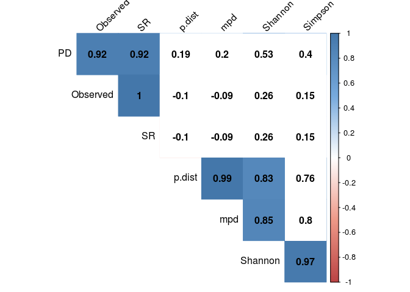
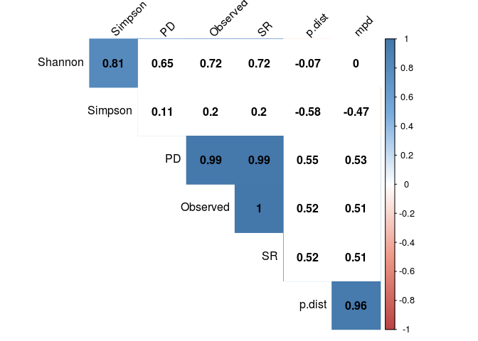
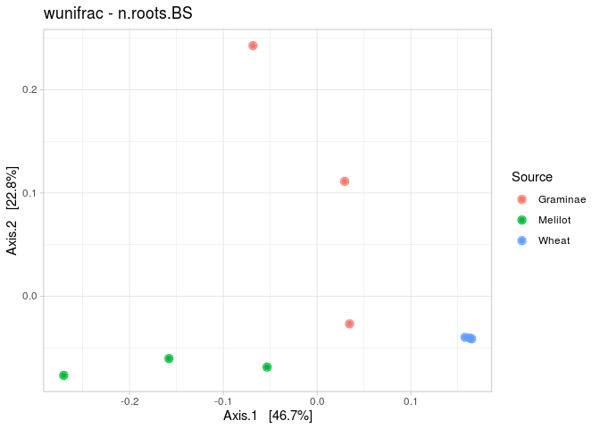
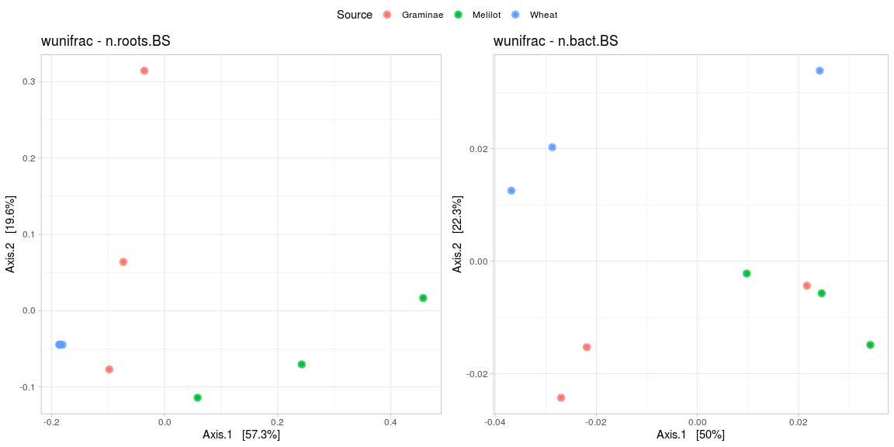

```r
library(phyloseq)
library(ggplot2)
library(dplyr)
library(ggpubr)
library(picante)
library(reshape2)
library(tidyr)
library(psych)
library(DESeq2)

setwd('/home/alexey/Analysis/RW/3rd publication/rhizofield/')
source('functions2.R')
```


```r
#Black soil
roots.BS <- readRDS('roots.BS.RData')
bact.BS <- readRDS('bact.BS.RData')

bact.BS <- subset_samples(bact.BS, Spot %in% c('1', '2', '3'))

ng.roots.BS <- rarefy_collapse(roots.BS)
ng.bact.BS <- rarefy_collapse(bact.BS)

#ng.roots.BS <- rarefy_even_depth(ng.roots.BS, 6352, verbose = FALSE)
```


```r
#Podzol soil
roots.PS <- readRDS('roots.PS.RData')
bact.PS <- readRDS('bact.PS.RData')

bact.PS <- subset_samples(bact.PS, Spot %in% c('1', '2', '3'))

ng.roots.PS <- rarefy_collapse(roots.PS)
ng.bact.PS <- rarefy_collapse(bact.PS)
```

## Представленность таксонов

### Состав корневых сообществ

Как задать корректный порог? Или все же отдельные графики?


```r
a <- phyloseq(otu_table(ng.roots.BS),
              tax_table(ng.roots.BS),
              sam_data(ng.roots.BS))
b <- phyloseq(otu_table(ng.roots.PS),
              tax_table(ng.roots.PS),
              sam_data(ng.roots.PS))
c <- merge_phyloseq(a, b)

bargraph(c, "Genus", 0.1) + facet_grid(~Soil, scale = 'free_x')
```

<!-- -->

```r
ggarrange(bargraph(ng.roots.BS, "Genus", 0.03),
          bargraph(ng.roots.PS, "Genus", 0.03),
          ncol = 2)
```

<!-- -->

### Состав бактериальных сообществ


```r
a <- phyloseq(otu_table(ng.bact.BS),
              tax_table(ng.bact.BS),
              sam_data(ng.bact.BS))
b <- phyloseq(otu_table(ng.bact.PS),
              tax_table(ng.bact.PS),
              sam_data(ng.bact.PS))
c <- merge_phyloseq(a, b)

bargraph(c, "Phylum", 0.03) + facet_grid(~Soil, scale = 'free_x')
```

<!-- -->


## Альфа-разнообразие

**Гипотеза: богатство корневых сообществ определяет богатство сообществ бактерий**

Четыре метрики. Индексы **richness** у нас представляют количество видов **Observed** и сумма длин веток дерева **PD**. За индексы **eveness** будут выступать индекс Симпсона **Simpson** и взвешенная средняя дистанция между последовательностями **mpd**.
Каким образом эти экологические метрики сочетаются с более "сырыми" дистанциями **p-value**, и можем ли мы увидеть "отпечатки" растительных сообществ в сообществах микроорганизмов?
Давайте посчитаем корреляцию между этими индексами, рассчитанными для разных почв в парах "корни - бактерии"


### Графики альфа-разнообразия


```r
drawer <- function(metric){
  p1 <- plot_correlation(ng.roots.BS, ng.bact.BS, metric)
  p3 <- plot_correlation(ng.roots.PS, ng.bact.PS, metric)
  ggarrange(p1, p3, ncol = 2)
}

drawer('Observed')
```

<!-- -->

```r
drawer('PD')
```

<!-- -->

```r
drawer('Simpson')
```

<!-- -->

```r
drawer('mpd')
```

<!-- -->

### Графики p-distance


```r
#p-distances
p.distances <- read.table('p-distances.csv', sep=',', header = T, row.names = 1)
colnames(p.distances) <- c("bact.mean", "bact.sd", "roots.mean", "roots.sd", "fungi.mean", "fungi.sd")
p.distances$Source <- c('Graminae', 'Graminae', 'Graminae',
                        'Melilot', 'Melilot', 'Melilot',
                        'Wheat', 'Wheat', 'Wheat',
                        'Bedstraw', 'Bedstraw', 'Bedstraw',
                        'Graminae', 'Graminae', 'Graminae',
                        'Rye', 'Rye', 'Rye')

p.distances.BS <- p.distances[1:9,]
p.distances.PS <- p.distances[10:18,]

p1 <- plot_p_distance(p.distances.BS, 'bact', 'BS')
p3 <- plot_p_distance(p.distances.PS, 'bact', 'PS')
ggarrange(p1, p3, ncol = 2)
```

<!-- -->

---

Любопытно. Индекс p-value, по-видимому, чувствительнее всего отражают предполагаемую нами зависимость, но и классические экологические метрики, особенно метрики eveness, ее отражают. 
Вероятно, мы оказываемся на границе чувствительности, так как при очень схожем паттерне достоверность то есть, то нет. 

---


## Бета-разнообразие

**Гипотеза: богатство корневых сообществ определяет богатство сообществ бактерий и грибов**

### Бета-разнообразие


```r
beta_plot_drawer("unifrac")
```

<!-- -->

```r
beta_plot_drawer("wunifrac")
```

<!-- -->

```r
beta_plot_drawer("bray")
```

<!-- -->


### Корреляця дистанций бета-разнообразия

Каждая точка на графике - численное выражение дистанция между двумя сообществами (например, Graminae.1 - Rye.2). По оси Х эта дистанция взята для растительных сообществ, по оси Y - для сообществ микроорганизмов. Насколько распределение дистанций в корневых сообществах повторяет его в сообществах микроорганизмов?


```r
beta_drawer <- function(metric){
  p1 <- beta_corr(ng.roots.BS, ng.bact.BS, metric)
  p3 <- beta_corr(ng.roots.PS, ng.bact.PS, metric)
  ggarrange(p1, p3, ncol = 2)
}

beta_drawer('unifrac')
```

<!-- -->

```r
beta_drawer('wunifrac')
```

<!-- -->

```r
beta_drawer('bray')
```

<!-- -->


## DeSEQ анализ

### Барграфы или таблицы в supplementary?

```r
plot_heatmap(ps_from_deseq(ng.bact.PS, "PS"), taxa.label = "Family", na.value = "white",
             high = "#000099", low = "white")
```

<!-- -->


```r
plot_heatmap(ps_from_deseq(ng.bact.BS, "BS"), taxa.label = "Family", na.value = "white",
             high = "#000099", low = "white")
```

<!-- -->


### Ternary plots


