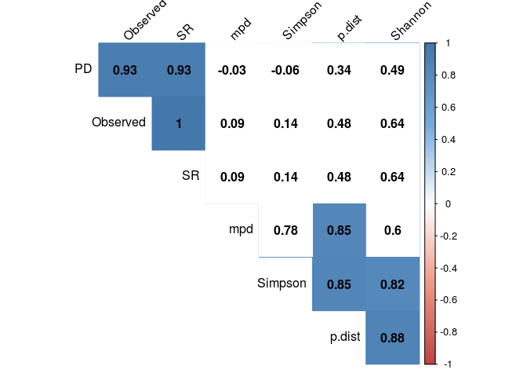
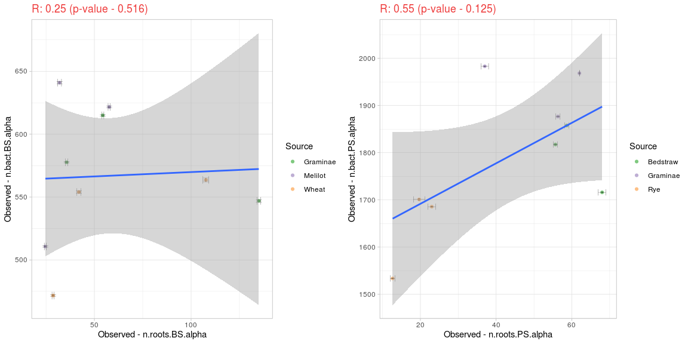
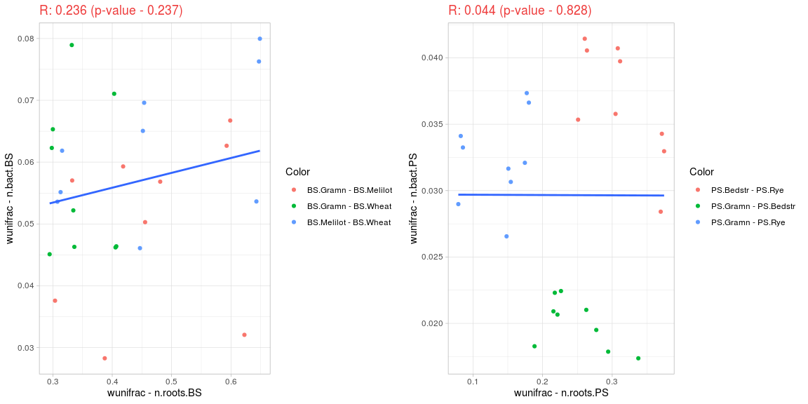

```r
library(phyloseq)
library(ggplot2)
library(gridExtra)
library(dplyr)
library(ggpubr)
library(picante)
library(reshape2)
library(magrittr)
library(data.table)
library(tidyr)
library(psych)
library(DESeq2)
library(fpc)

setwd('/home/alexey/Analysis/RW/3rd publication/rhizofield/')
source('functions2.R')
```


```r
#Black soil
roots.BS <- readRDS('roots.BS.RData')
bact.BS <- readRDS('bact.BS.RData')  %>% subset_taxa(Family != "Mitochondria" & Class != "Chloroplast")

bact.BS <- subset_samples(bact.BS, Spot %in% c('1', '2', '3'))

n.roots.BS <- rarefy_collapse(roots.BS)
n.bact.BS <- rarefy_collapse(bact.BS)

n.roots.BS@phy_tree <- ape::root(n.roots.BS@phy_tree, outgroup=pick_new_outgroup(n.roots.BS@phy_tree), resolve.root=TRUE)
n.bact.BS@phy_tree <- ape::root(n.bact.BS@phy_tree, outgroup=pick_new_outgroup(n.bact.BS@phy_tree), resolve.root=TRUE)
```


```r
#Podzol soil
roots.PS <- readRDS('roots.PS.RData')
bact.PS <- readRDS('bact.PS.RData') %>% subset_taxa(Family != "Mitochondria" & Class != "Chloroplast")

bact.PS <- subset_samples(bact.PS, Spot %in% c('1', '2', '3'))

n.roots.PS <- rarefy_collapse(roots.PS)
n.bact.PS <- rarefy_collapse(bact.PS)

n.roots.PS@phy_tree <- ape::root(n.roots.PS@phy_tree, outgroup=pick_new_outgroup(n.roots.PS@phy_tree), resolve.root=TRUE)
n.bact.PS@phy_tree <- ape::root(n.bact.PS@phy_tree, outgroup=pick_new_outgroup(n.bact.PS@phy_tree), resolve.root=TRUE)
```

# Представленность таксонов

## Состав корневых сообществ

Как задать корректный порог? Или все же отдельные графики?


```r
a <- phyloseq(otu_table(n.roots.BS),
              tax_table(n.roots.BS),
              sam_data(n.roots.BS))
b <- phyloseq(otu_table(n.roots.PS),
              tax_table(n.roots.PS),
              sam_data(n.roots.PS))
c <- merge_phyloseq(a, b)

bargraph(c, "Genus", 0.1) + facet_grid(~Soil, scale = 'free_x')
```

<!-- -->

```r
ggarrange(bargraph(n.roots.BS, "Genus", 0.03),
          bargraph(n.roots.PS, "Genus", 0.03),
          ncol = 2)
```

<!-- -->

## Состав бактериальных сообществ


```r
a <- phyloseq(otu_table(n.bact.BS),
              tax_table(n.bact.BS),
              sam_data(n.bact.BS))
b <- phyloseq(otu_table(n.bact.PS),
              tax_table(n.bact.PS),
              sam_data(n.bact.PS))
c <- merge_phyloseq(a, b)

bargraph(c, "Phylum", 0.03) + facet_grid(~Soil, scale = 'free_x')
```

<!-- -->


# Альфа-разнообразие

**Гипотеза: богатство корневых сообществ определяет богатство сообществ бактерий**

Четыре метрики. Индексы **richness** у нас представляют количество видов **Observed** и сумма длин веток дерева **PD**. За индексы **eveness** будут выступать индекс Симпсона **Simpson** и взвешенная средняя дистанция между последовательностями **mpd**.
Каким образом эти экологические метрики сочетаются с более "сырыми" дистанциями **p-value**, и можем ли мы увидеть "отпечатки" растительных сообществ в сообществах микроорганизмов?
Давайте посчитаем корреляцию между этими индексами, рассчитанными для разных почв в парах "корни - бактерии"


## Графики корреляции метрик альфа-разнообразия


```r
plot_internal_correlation(alpha_div(n.roots.BS, pairwise_distances_from_ps(n.roots.BS)) %>% select(-Source, -Spot))
```

<!-- -->

```r
plot_internal_correlation(alpha_div(n.roots.PS, pairwise_distances_from_ps(n.roots.PS)) %>% select(-Source, -Spot))
```

<!-- -->

```r
plot_internal_correlation(alpha_div(n.bact.BS, pairwise_distances_from_ps(n.bact.BS)) %>% select(-Source, -Spot))
```

<!-- -->

```r
plot_internal_correlation(alpha_div(n.bact.PS, pairwise_distances_from_ps(n.bact.PS)) %>% select(-Source, -Spot))
```

<!-- -->

## Корреляция корневых и бактериальных метрик разнообразия


```r
# Metrics
n.roots.BS.alpha <- bootstrapped_alpha_div(n.roots.BS)
n.roots.PS.alpha <- bootstrapped_alpha_div(n.roots.PS)
n.bact.BS.alpha <- bootstrapped_alpha_div(n.bact.BS)
n.bact.PS.alpha <- bootstrapped_alpha_div(n.bact.PS)

drawer <- function(metric){
  p1 <- plot_correlation(n.roots.BS.alpha, n.bact.BS.alpha, metric)
  p3 <- plot_correlation(n.roots.PS.alpha, n.bact.PS.alpha, metric)
  ggarrange(p1, p3, ncol = 2)
}

drawer('Observed')
```

<!-- -->

```r
drawer('PD')
```

<!-- -->

```r
drawer('Simpson')
```

<!-- -->

```r
drawer('mpd')
```

<!-- -->

```r
drawer('p.dist')
```

<!-- -->


Вероятно, мы оказываемся на границе чувствительности, так как при очень схожем паттерне достоверность то есть, то нет. 

---


# Бета-разнообразие

**Гипотеза: богатство корневых сообществ определяет богатство сообществ бактерий и грибов**

## Бета-разнообразие


```r
beta_plot_drawer <- function(metric){
  p1 <- beta_plot(n.roots.PS, metric)
  p2 <- beta_plot(n.bact.PS, metric)
  p3 <- beta_plot(n.roots.BS, metric)
  p4 <- beta_plot(n.bact.BS, metric)
  
  ggarrange(ggarrange(p1, p2, common.legend = T, legend = 'bottom'),
            ggarrange(p3, p4, common.legend = T, legend = 'bottom'),
            nrow = 2)
}


beta_plot_drawer("unifrac")
```

<!-- -->

## Статистика для кластеров бета-разнообразия

Гипотеза: структура кластеров похожа. Для этого используем статистики из пакета кластерного анализа. Использованы следующие метрики:

Для кластера:

* Dunn - индекс Дунна. Рассчитывается один на весь плот, мера силы кластеризации. Отношение минимальной меры сепарации к максимальному диаметру кластера.
* Median_dist - медианная дистанция. Медианная дистанция между точками в выбранном классе.
* Min_separation - минимальная величина сепарации. Минимальное расстояние от между точкой, принадлежащей этому кластеру, и точкой, принадлежащей любому другому кластеру.

Для пары кластеров:

* Clusters_Separation - минимальная дистанция между точкой в одном кластере и точкой в другом кластере.
* Distance_Between - средняя дистанция между кластерами.


```r
# https://www.rdocumentation.org/packages/fpc/versions/2.2-9/topics/cluster.stats

# because every run of unifrac is unique, we should use bootstrap as multiple calculation
# (or, perhaps, root the tree?)
bootstrapped_wunifrac_cluster_stat <- function(ps, repeats){
  # dm <- as.matrix(UniFrac(ps, weighted=TRUE))
  dm.matrices <- replicate(repeats, as.matrix(UniFrac(ps, weighted=TRUE)), simplify = FALSE)
  true.dm <- Reduce("+", dm.matrices) / length(dm.matrices)
  info <- sample_data(ps)$Source
  clusters <- levels(info)
  levels(info) <- c(1, 2, 3)
  info <- as.numeric(as.vector(info))
  res <- cluster.stats(d = true.dm, clustering = info, silhouette = FALSE)
  common <- data.frame(Cluster = clusters,
             Median_Dist = res$median.distance,
             Min_separation = res$separation,
             # Sepr_m = res$separation.matrix,
             # AvBtw_m = res$ave.between.matrix,
             Dunn = res$dunn) %>% 
    mutate_if(is.numeric, round, digits = 3)
  matrix_to_df <- function(X, names){
      colnames(X) <- clusters
      rownames(X) <- clusters
      ind <- which(upper.tri(X, diag = F), arr.ind = TRUE)
      nn <- dimnames(X)
      data.frame(Cluster_1 = nn[[1]][ind[, 1]],
           Cluster_2 = nn[[2]][ind[, 2]],
           val = X[ind])
  }
  extra2 <- matrix_to_df(res$ave.between.matrix, clusters) %>% rename(Distance_Between = val)
  extra <- matrix_to_df(res$separation.matrix, clusters) %>% rename(Clusters_Separation = val)
  extra <- merge(extra, extra2, by = c('Cluster_1', 'Cluster_2'))
  list(common, extra)
}
```

### Чернозем


```r
p1 <- beta_plot(n.roots.BS, 'wunifrac')
d1 <- bootstrapped_wunifrac_cluster_stat(n.roots.BS, 100)

p2 <- beta_plot(n.bact.BS, 'wunifrac')
d2 <- bootstrapped_wunifrac_cluster_stat(n.bact.BS, 100)


ggarrange(p1, p2, common.legend = T)
```

<!-- -->

```r
merge(d1[1] %>% as.data.frame(), d2[1] %>% as.data.frame, 
      by = 'Cluster', 
      suffixes = c(":Roots",":Bact")) %>%  select(order(colnames(.)))
```

```
##    Cluster Dunn:Bact Dunn:Roots Median_Dist:Bact Median_Dist:Roots
## 1 Graminae     0.412       0.63            0.053             0.381
## 2  Melilot     0.412       0.63            0.037             0.283
## 3    Wheat     0.412       0.63            0.061             0.016
##   Min_separation:Bact Min_separation:Roots
## 1               0.028                0.295
## 2               0.028                0.304
## 3               0.045                0.295
```

```r
merge(d1[2] %>% as.data.frame(), d2[2] %>% as.data.frame, 
      by = c('Cluster_1', 'Cluster_2'), 
      suffixes = c(":Roots",":Bact")) %>%  select(order(colnames(.)))
```

```
##   Cluster_1 Cluster_2 Clusters_Separation:Bact Clusters_Separation:Roots
## 1  Graminae   Melilot               0.02826693                 0.3036948
## 2  Graminae     Wheat               0.04510017                 0.2945624
## 3   Melilot     Wheat               0.04608170                 0.3077156
##   Distance_Between:Bact Distance_Between:Roots
## 1            0.05008256              0.4658108
## 2            0.05708553              0.3456730
## 3            0.06235633              0.4696738
```

### Подзол


```r
p1 <- beta_plot(n.roots.PS, 'wunifrac')
d1 <- bootstrapped_wunifrac_cluster_stat(n.roots.PS, 100)

p2 <- beta_plot(n.bact.PS, 'wunifrac')
d2 <- bootstrapped_wunifrac_cluster_stat(n.bact.PS, 100)


ggarrange(p1, p2, common.legend = T)
```

<!-- -->

```r
merge(d1[1] %>% as.data.frame(), d2[1] %>% as.data.frame, 
      by = 'Cluster', 
      suffixes = c(":Roots",":Bact")) %>%  select(order(colnames(.)))
```

```
##    Cluster Dunn:Bact Dunn:Roots Median_Dist:Bact Median_Dist:Roots
## 1 Bedstraw     0.814       0.32            0.020             0.219
## 2 Graminae     0.814       0.32            0.019             0.092
## 3      Rye     0.814       0.32            0.021             0.012
##   Min_separation:Bact Min_separation:Roots
## 1               0.017                0.188
## 2               0.017                0.079
## 3               0.027                0.079
```

```r
merge(d1[2] %>% as.data.frame(), d2[2] %>% as.data.frame, 
      by = c('Cluster_1', 'Cluster_2'), 
      suffixes = c(":Roots",":Bact")) %>%  select(order(colnames(.)))
```

```
##   Cluster_1 Cluster_2 Clusters_Separation:Bact Clusters_Separation:Roots
## 1  Bedstraw  Graminae               0.01737153                0.18841349
## 2  Bedstraw       Rye               0.02841299                0.25096920
## 3  Graminae       Rye               0.02655707                0.07891098
##   Distance_Between:Bact Distance_Between:Roots
## 1            0.02003923              0.2489771
## 2            0.03658195              0.3127612
## 3            0.03236464              0.1369178
```


ПРОБЛЕМА: мы не можем делать никаких выводов на основании трех точек

## Корреляця дистанций бета-разнообразия

### Самодельная функция

Каждая точка на графике - численное выражение дистанция между двумя сообществами (например, Graminae.1 - Rye.2). По оси Х эта дистанция взята для растительных сообществ, по оси Y - для сообществ микроорганизмов. Насколько распределение дистанций в корневых сообществах повторяет его в сообществах микроорганизмов?


```r
beta_drawer <- function(metric){
  p1 <- beta_corr(n.roots.BS, n.bact.BS, metric)
  p3 <- beta_corr(n.roots.PS, n.bact.PS, metric)
  ggarrange(p1, p3, ncol = 2)
}

beta_drawer('wunifrac')
```

<!-- -->

```r
beta_drawer('bray')
```

<!-- -->

ПРОБЛЕМА: не соблюдено условие гомоскедастичности остатков, мы не можем использовать корреляционный анализ

### Тест Мантеля


```r
mantel_beta_correlation <- function(ps.1, ps.2, method){
  mtr1 <- phyloseq::distance(get(as.character(ps.1)), method=as.character(method))
  mtr2 <- phyloseq::distance(get(as.character(ps.2)), method=as.character(method))
  fit <- mantel(mtr1, mtr2, method="spearman", permutations=999, parallel = getOption("12"))
  return(round(c(fit$statistic, fit$signif), 3))
}

# mantel_beta_correlation('n.roots.BS', 'n.bact.BS', 'wunifrac')

data.frame(ps.1 = c('n.roots.BS', 'n.roots.PS'),
                 ps.2 = c('n.bact.BS', 'n.bact.PS')) %>%
  merge(data.frame(method = c('wunifrac', 'bray')), all=T) %>% 
  rowwise() %>% 
  mutate(res = list(mantel_beta_correlation(ps.1, ps.2, method))) %>% 
  mutate(Mnt_stat = res[1], Mnt_signif = res[2]) %>% select(-res)
```

```
## # A tibble: 4 x 5
## # Rowwise: 
##   ps.1       ps.2      method   Mnt_stat Mnt_signif
##   <fct>      <fct>     <fct>       <dbl>      <dbl>
## 1 n.roots.BS n.bact.BS wunifrac    0.224      0.096
## 2 n.roots.PS n.bact.PS wunifrac    0.31       0.063
## 3 n.roots.BS n.bact.BS bray        0.814      0.003
## 4 n.roots.PS n.bact.PS bray        0.878      0.001
```

Результат очень похож на наши корреляции

# DeSEQ анализ

## Достоверно изменяющие численность таксоны


```r
plot_heatmap(ps_from_deseq(n.bact.PS, "PS", "Family"), taxa.label = "Family", na.value = "white",
             high = "#000099", low = "grey")
```

<!-- -->


```r
plot_heatmap(ps_from_deseq(n.bact.BS, "BS", "Family"), taxa.label = "Family", na.value = "white",
             high = "#000099", low = "grey")
```

<!-- -->


## Ternary plots

See [here](https://github.com/a-zverev/rhizofield/blob/master/ggtern_diagrams.md)


