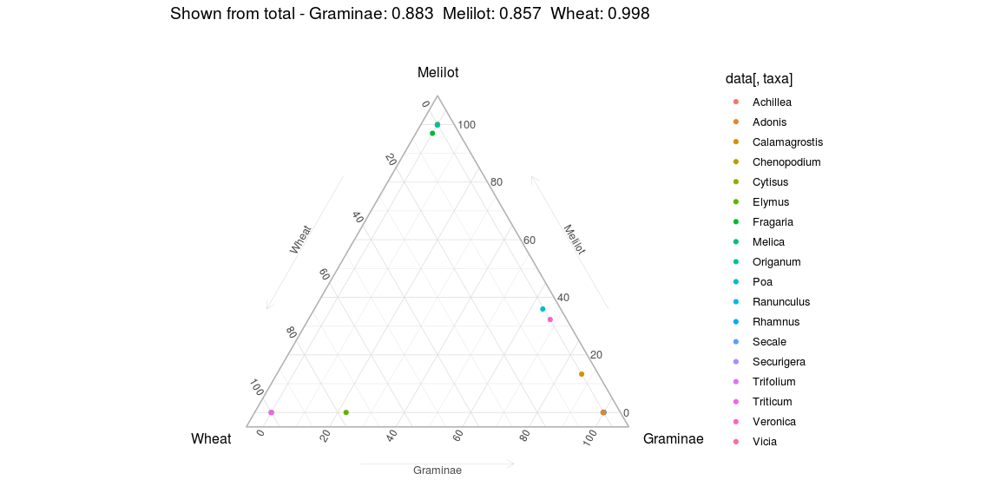
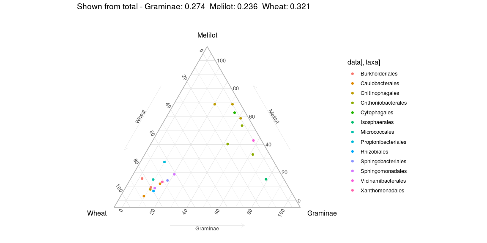
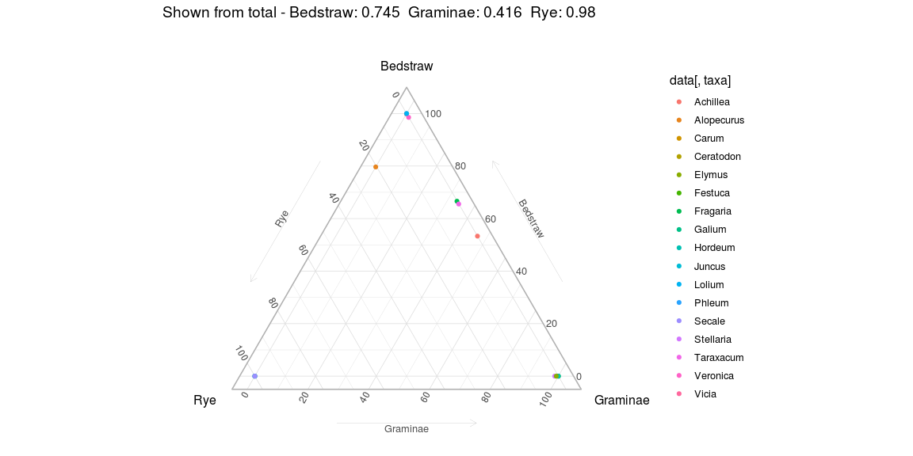
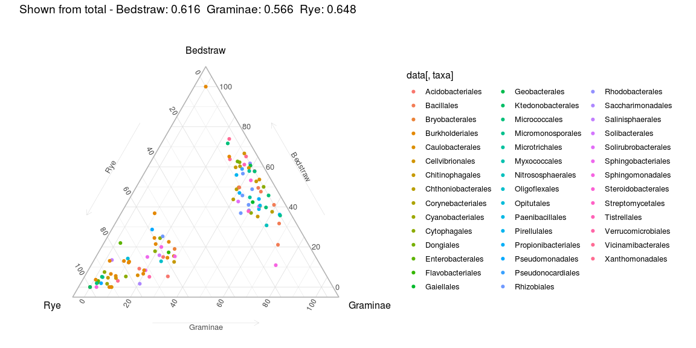

```r
library(phyloseq)
library(ggplot2)
library(dplyr)
library(ggpubr)
library(picante)
library(reshape2)
library(tidyr)
library(psych)
library(DESeq2)

setwd('/home/alexey/Analysis/RW/3rd publication/rhizofield/')
source('functions2.R')
```


```r
#Black soil
roots.BS <- readRDS('roots.BS.RData')
bact.BS <- readRDS('bact.BS.RData')

bact.BS <- subset_samples(bact.BS, Spot %in% c('1', '2', '3'))

ng.roots.BS <- rarefy_collapse(roots.BS)
ng.bact.BS <- rarefy_collapse(bact.BS)

#ng.roots.BS <- rarefy_even_depth(ng.roots.BS, 6352, verbose = FALSE)
```


```r
#Podzol soil
roots.PS <- readRDS('roots.PS.RData')
bact.PS <- readRDS('bact.PS.RData')

bact.PS <- subset_samples(bact.PS, Spot %in% c('1', '2', '3'))

ng.roots.PS <- rarefy_collapse(roots.PS)
ng.bact.PS <- rarefy_collapse(bact.PS)
```


```r
  #Attention!
  #There is absolutely NO WAY to start ggtern without a conflict with ggplot. 
  #So, use it STRONGLY after all regular plots!

sig_taxa_from_deseq <- function(ps, soil){
  require(phyloseq)
  if (soil == "BS") {
    ps.1 <- subset_samples(ps, Source %in% c('Graminae', 'Wheat'))
    ps.2 <- subset_samples(ps, Source %in% c('Melilot', 'Wheat'))
    ps.3 <- subset_samples(ps, Source %in% c('Melilot', 'Graminae'))
  }
  if (soil == "PS") {
    ps.1 <- subset_samples(ps, Source %in% c('Graminae', 'Rye'))
    ps.2 <- subset_samples(ps, Source %in% c('Bedstraw', 'Rye'))
    ps.3 <- subset_samples(ps, Source %in% c('Bedstraw', 'Graminae'))
  }
  a <- sig_table(ps.1)
  b <- sig_table(ps.2)
  c <- sig_table(ps.3)
  names <- unique(c(rownames(a), rownames(b), rownames(c)))
  ps <- prune_taxa(names, ps)
  ps <- merge_samples(ps, "Source")
  data <- as.data.frame(cbind(t(otu_table(ps)), tax_table(ps)))
  data[,1] <- as.numeric(as.character(data[,1]))
  data[,2] <- as.numeric(as.character(data[,2]))
  data[,3] <- as.numeric(as.character(data[,3]))
  return(data)
}

draw_ggtern <- function(ps, soil, taxa){
  #Attention!
  #There is absolutely NO WAY to start ggtern without a conflict with ggplot. 
  #So, use is STRONGLY after all regular plots!
  st <- sig_taxa_from_deseq(ps, soil)
  sig.reads <- colSums(st[,1:3])
  all.reads <- colSums(t(otu_table(merge_samples(ps, "Source"))))
  res <- c(round(sig.reads / all.reads, 3))
  title <- paste0("Shown from total - ",
                names(res[1]), ": ", res[1], "  ",
                names(res[2]), ": ", res[2], "  ",
                names(res[3]), ": ", res[3], "  ")
  data <- sig_taxa_from_deseq(ps, soil)
  if (soil == "BS") {p1 <- ggtern::ggtern(data=data, aes(x=Wheat, y=Melilot, z=Graminae, color = data[,taxa]))}
  if (soil == "PS") {p1 <- ggtern::ggtern(data=data, aes(x=Rye, y=Bedstraw, z=Graminae, color = data[,taxa]))}
  p1 + 
    geom_point() + 
    ggtitle(title) +
    ggtern::limit_tern(1.1,1.1,1.1)  + 
    ggtern::theme_light() + 
    ggtern::theme_showarrows()
}
```


```r
  #Attention!
  #There is absolutely NO WAY to start ggtern without a conflict with ggplot. 
  #So, use is STRONGLY after all regular plots!

draw_ggtern(ng.roots.BS, "BS", "Genus")
```

```
## Warning: Solution to limits produces range outside of [0,1] for some scales
```

<!-- -->

```r
draw_ggtern(ng.bact.BS, "BS", "Order")
```

```
## Warning: Solution to limits produces range outside of [0,1] for some scales
```

<!-- -->

```r
draw_ggtern(ng.roots.PS, "PS", "Genus")
```

```
## Warning: Solution to limits produces range outside of [0,1] for some scales
```

<!-- -->

```r
draw_ggtern(ng.bact.PS, "PS", "Order")
```

```
## Warning: Solution to limits produces range outside of [0,1] for some scales
```

<!-- -->

```r
#roots - Clade - Class - Order - Family - Genus
#bact - Kingdom - Phylum - Class - Order - Family - Genus
```
