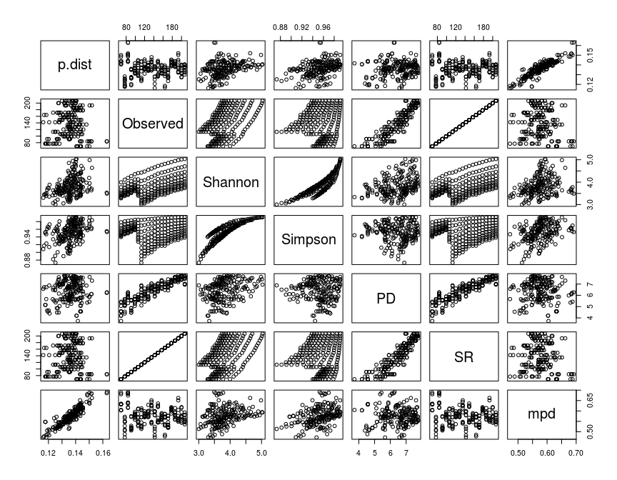

```r
knitr::opts_chunk$set(
	fig.align = "center",
	fig.height = 7,
	fig.width = 9,
	message = FALSE,
	warning = FALSE
)
# Libs and staff

library(mobsim)
library(phangorn)
library(phyloseq)
library(DECIPHER)
library(Biostrings)
library(tidyverse)
library(reshape2)
library(seqinr)
library(picante)
library(corrplot)
library(plotly)
library(ggpubr)
```

---

## Function for alpha-measures

Aim: from ps-object return df with followed alpha-metrics: Observed OTUs, Simpson, Shannon, SD (as a reference. Must be equal Observed), Faith's PD, mpd and p-distance.

There are ready functions for calculating.

Troubles: non-linear Shannon


```r
pairwise_distances_from_ps <- function(ps){
  # Multiple alignment
  alignment <- AlignSeqs(refseq(ps), gapOpening=c(-16, -12), gapExtension=c(-12, -8), processors = 25, verbose = FALSE)
  
  # Transform alignment to seqinr, calculate distance matrix
  seqinr.alignment <- as.alignment(nb = length(alignment), 
                                   nam = names(alignment), 
                                   seq = as.character(alignment), 
                                   com = width(alignment))
  am <- as.matrix(dist.alignment(seqinr.alignment, matrix = "identity"))
  
  #form lower triangle pairs data
  am[lower.tri(am, diag = TRUE)] <- NA
  dm <- melt(am, varnames = c("V1", "V2")) %>% 
    filter(!is.na(value)) %>% 
    mutate(pid = -(value^2 - 1)*100,
           pseudo.p.dist = 1 + (value^2 - 1)) %>% 
    select(-value)

  return(dm)
}

generate_community <- function(species, cv_abund, length, n_sim, shuffle){
  set.seed(6373)
  res <- as.vector(sim_sad(s_pool = species, n_sim = n_sim, sad_type = "lnorm",
                       sad_coef = list("cv_abund" = cv_abund), fix_s_sim = T))
  if (length(res) < length){
    res <- c(res, rep(0, length-length(res)))
  }
  if (shuffle == TRUE){
    res <- sample(res)
  }
  return(res)
}

construct_random_communities <- function(mask.ps, species, cv_abund, n_sim, shuffle){

  length(refseq(mask.ps)) # maximum length for community - real number of sequences
  
  # Massive of parameters for random generation of communities
  df <- expand.grid(
    species = species, 
    cv_abund = cv_abund)
  df$length <- length(refseq(mask.ps))
  df$shuffle <- FALSE
  df$n_sim <- 20000
  
  if (hasArg(shuffle)){
    df$shuffle <- TRUE
  }
  if (hasArg(n_sim)){
    df$n_sim <- n_sim
  }
  
  # df[2,]
  # do.call(generate_community, (as.list(df[2,])))
  
  # create new pseudo-OTU-table
  communities <- lapply(1:nrow(df),
                        function(x) do.call(generate_community, (as.list(df[x,]))))

  communities.df <- data.frame(matrix(unlist(communities),
                                      ncol=length(communities),
                                      byrow=F))
  rownames(communities.df) <- names(refseq(mask.ps))
  communities.ps <- phyloseq(mask.ps@tax_table,
                             mask.ps@phy_tree,
                             otu_table(t(as.matrix(communities.df)), taxa_are_rows = F))

  return(communities.ps)
}

weighted_p_distance_from_ps <- function(ps, distance_matrix){
  ps <- prune_taxa(taxa_sums(ps) > 0, ps)
  df <- t(otu_table(ps)) %>% as.data.frame()
  
  multiple_p_dist <- function(column){
    df <- data.frame(column)
    df  %>% filter(.[,1] != 0)
    colnames(df) <- "Abd"
    df$V <- rownames(df)
    distance_matrix %>%
    inner_join(df, by = c("V1" = "V")) %>%
    inner_join(df, by = c("V2" = "V")) %>%
    mutate(weight = (Abd.y / sum(df$Abd) * (Abd.x / sum(df$Abd))),
          weighted.pseudo.p.dist = pseudo.p.dist * weight) %>%
    select(weighted.pseudo.p.dist) %>% sum()
  }
  
  p.dist <- apply(df, 2, multiple_p_dist)
  pd.tree <- pd(ps@otu_table@.Data, ps@phy_tree, include.root = FALSE)
  obs_sim <- estimate_richness(ps, split = TRUE, measures = c("Observed", "Simpson", "Shannon"))
  mpd <- mpd(ps@otu_table@.Data, cophenetic(ps@phy_tree), 
             abundance.weighted = TRUE)
  alpha <- cbind(p.dist, obs_sim, pd.tree, mpd)
  return(alpha)
}

# Plot correlations in alpha-metrics
plot_correlation <- function(df){
  col <- colorRampPalette(c("#BB4444", "#EE9988", "#FFFFFF", "#77AADD", "#4477AA"))
  cor.mtest <- function(mat, ...) {
      mat <- as.matrix(mat)
      n <- ncol(mat)
      p.mat<- matrix(NA, n, n)
      diag(p.mat) <- 0
      for (i in 1:(n - 1)) {
          for (j in (i + 1):n) {
              tmp <- cor.test(mat[, i], mat[, j], ...)
              p.mat[i, j] <- p.mat[j, i] <- tmp$p.value
          }
      }
    colnames(p.mat) <- rownames(p.mat) <- colnames(mat)
    p.mat
  }
  p.mat <- cor.mtest(df)
  corrplot(cor(df), method="color", col=col(200),  
           type="upper", order="hclust", 
           addCoef.col = "black", # Add coefficient of correlation
           tl.col="black", tl.srt=45, #Text label color and rotation
           # Combine with significance
           p.mat = p.mat, sig.level = 0.01, insig = "blank", 
           # hide correlation coefficient on the principal diagonal
           diag=FALSE 
           )
    
}

# Fibonacci generator
fib_before <- function(n){
  fib <- vector()
  fib[1]=1
  fib[2]=2
  for(i in 3:n){
    fib[i] <- fib[i-1]+fib[i-2]
    if (fib[i] > n) {
      return(fib[1:length(fib)-1])
    }
  }
} 
```

---

## How to run functions

How we can run all this functions? Example:

* more reads means less strong phylogenetic signal


```r
# Read ps
p <- readRDS('roots.BS.RData')

# Generate pairwise distances
pw.distances <- pairwise_distances_from_ps(p)

# How many real refs we have?
length(refseq(p)) # 423
```

```
## [1] 423
```

```r
# Generate random community according this data
random.ps <- construct_random_communities(mask.ps = p,
                                          species = sapply(seq.int(110, length(refseq(p)) - 30, length.out=20), ceiling),
                                          cv_abund = 1:10, 
                                          n_sim = 50 * sapply(seq.int(100, length(refseq(p)), length.out=20), ceiling),
                                          shuffle = F)

# Calculate metrics for random communities, draw a plot
metrics <- weighted_p_distance_from_ps(random.ps, pw.distances)

## Explore metrics 

# 3D plot (comment for github)
plot_ly(x=metrics$Observed, y=metrics$Simpson, z=metrics$Shannon, type="scatter3d", mode="markers", size = 1) %>%
  layout(title = "3d scatter plot for simulated OTUs communities",
    scene = list(
      xaxis = list(title = "ObservedOTUs"),
      yaxis = list(title = "Simpson"),
      zaxis = list(title = "Shannon")
    ))
```

<!--html_preserve--><div id="htmlwidget-aeb10c4e73306a10df6d" style="width:864px;height:672px;" class="plotly html-widget"></div>
<script type="application/json" data-for="htmlwidget-aeb10c4e73306a10df6d">{"x":{"visdat":{"5884429d8d04":["function () ","plotlyVisDat"]},"cur_data":"5884429d8d04","attrs":{"5884429d8d04":{"x":[110,125,140,155,170,185,200,215,230,245,259,274,289,304,319,334,349,364,379,393,110,125,140,155,170,185,200,215,230,245,259,274,289,304,319,334,349,364,379,393,110,125,140,155,170,185,200,215,230,245,259,274,289,304,319,334,349,364,379,393,110,125,140,155,170,185,200,215,230,245,259,274,289,304,319,334,349,364,379,393,110,125,140,155,170,185,200,215,230,245,259,274,289,304,319,334,349,364,379,393,110,125,140,155,170,185,200,215,230,245,259,274,289,304,319,334,349,364,379,393,110,125,140,155,170,185,200,215,230,245,259,274,289,304,319,334,349,364,379,393,110,125,140,155,170,185,200,215,230,245,259,274,289,304,319,334,349,364,379,393,110,125,140,155,170,185,200,215,230,245,259,274,289,304,319,334,349,364,379,393,110,125,140,155,170,185,200,215,230,245,259,274,289,304,319,334,349,364,379,393],"y":[0.98436152,0.985685207100592,0.98756253063043,0.989006411999474,0.989895946712018,0.990761887509131,0.991403313400647,0.991742974500115,0.992398922723355,0.992841381680701,0.993245037037037,0.993623377727058,0.994004648545706,0.994099133354684,0.994424536955989,0.994458197976592,0.99487172505492,0.995135305740776,0.995304685869592,0.995450843630714,0.97034448,0.972219972240485,0.976317264424148,0.979584088417175,0.981164540816327,0.983014100803506,0.984064385844525,0.984967552803319,0.985888738868141,0.986947635488759,0.987470661179698,0.988433619444208,0.989287837603878,0.989304148833959,0.989956983298904,0.989777780599087,0.990575777546537,0.990919298709366,0.991456662379577,0.991626797221244,0.95453864,0.95860086200599,0.964629004232568,0.9696521731503,0.971861592970522,0.974653195032871,0.97625099500049,0.977673059360731,0.978937273771905,0.980650758487088,0.980748828532236,0.982943796816764,0.984051809210526,0.984036715482187,0.985298939112776,0.985159788930768,0.986354249046132,0.986792352680725,0.987685277487927,0.988174996786435,0.93940608,0.945167243772372,0.953119135664959,0.959901688522433,0.963052465986395,0.96676815193572,0.969256798353103,0.971170192448031,0.972687905774203,0.974726891530878,0.974711879286694,0.977997363085627,0.979084435595568,0.979464679108316,0.981090234935752,0.981051594524896,0.982667291016302,0.983062623165324,0.984266470916547,0.984719266301159,0.9249868,0.934443187961137,0.942448785921141,0.950722792859962,0.955030697278912,0.959484797662527,0.962514988726595,0.964792010174934,0.96682219189888,0.969337774375478,0.97120283127572,0.973423234469278,0.974368447022161,0.975246381537446,0.977614243198768,0.977786832771276,0.979104965892011,0.979984890398557,0.981287354704069,0.981777733067306,0.91343656,0.925001095770327,0.93384455335264,0.942502521819218,0.947119246031746,0.952738127100073,0.956572041956671,0.959646179187256,0.961393263430049,0.963976753269072,0.966358310013717,0.9701866187522,0.970377536357341,0.971399671975233,0.974006330310563,0.97420085855981,0.976076806567233,0.976757605355502,0.978820286830547,0.979453436838075,0.90274344,0.915496997589305,0.925687458231232,0.935172422262181,0.940550765306122,0.946380645726808,0.951302499754926,0.954565651258314,0.95643885377765,0.959539789717071,0.96218180521262,0.966251458679843,0.967801869806094,0.968774945895323,0.970884990021358,0.971226940686372,0.973203959995375,0.97406625650108,0.976565459001674,0.977320461188516,0.89298256,0.908059960552268,0.918156471374471,0.929050971448621,0.934549688208617,0.940709446311176,0.945753337908048,0.949761531244136,0.951963142775065,0.955224821509475,0.958280592592593,0.962909677184378,0.964267797783934,0.965728686639299,0.968780056720703,0.968840950605039,0.97057333217713,0.971687102252827,0.97439486519935,0.975304014441482,0.8836152,0.901236262692673,0.911899532189797,0.922042050787246,0.929567913832199,0.935627406866326,0.941079266738555,0.945057058860324,0.947429617925883,0.951080791763658,0.954510737997256,0.959909936990858,0.961405245844875,0.962985281586941,0.966181408213998,0.966475477087879,0.968500659035727,0.969214789751588,0.972627639593293,0.973371614439247,0.87510568,0.894316137044342,0.905845444419693,0.916621165738345,0.924023894557823,0.931355021183345,0.936857386530732,0.941056374971331,0.943617322608446,0.947089103094877,0.951048965706447,0.956969850307761,0.958530566135734,0.960287357459652,0.963887181821365,0.964435729418766,0.966091617528038,0.967599373517225,0.970596131912932,0.971701526303729],"z":[4.41446122399006,4.52039446974114,4.65366201295558,4.76398542965516,4.85448481452196,4.93690969958642,5.01475300243974,5.0661185892352,5.14309951190647,5.20497346156345,5.26014007271803,5.31695931224714,5.37206443860716,5.40482211414567,5.45374567980987,5.48559171488613,5.54432101331204,5.59283455893339,5.62904693216891,5.66585661327253,4.05531955756441,4.13707707166044,4.2927522857395,4.41859412699459,4.503465477983,4.59143949687826,4.66255606587993,4.72509101217108,4.78719792230505,4.86223866216247,4.91736711175657,4.97928888814555,5.04437953870322,5.05499563646216,5.10518156065472,5.12250488383475,5.18098693189414,5.22661588380245,5.26965343125798,5.30506667132361,3.79563058057374,3.87306777459829,4.03540217864896,4.17485925946111,4.25455434617391,4.34493929931253,4.41517837040207,4.47658972200173,4.54480033604282,4.62823602557533,4.64940436004703,4.7254618762902,4.78929892180792,4.79220072987461,4.85137519714434,4.86366390753026,4.93207466774859,4.97859596876038,5.0240219571722,5.06915929817645,3.59730592058143,3.6717352946797,3.84509243474455,3.99416256798105,4.07124982664575,4.16695483804547,4.23554663140539,4.29906454864299,4.36642408734278,4.4507698475299,4.46840948572041,4.5562041757433,4.61349504382202,4.61680276814213,4.68207019338135,4.68663451846244,4.76072868810863,4.80415361069893,4.84621392297712,4.89174976371718,3.4431303286883,3.53118179698269,3.69456144483247,3.85063040215067,3.92846425985123,4.02730995259125,4.09613897005273,4.16111675452321,4.22575960071541,4.31410679671011,4.36723924286386,4.41987822206783,4.47520898333442,4.4837695861742,4.55999254691716,4.56470355243346,4.62380346150257,4.67601866414663,4.71163352812843,4.75935432403651,3.32809703723724,3.41538457902946,3.58301310046778,3.73818463204111,3.81431419978941,3.91633056170257,3.98743528730432,4.05566536456332,4.11633791305356,4.20374489045796,4.25610226095145,4.34364785253773,4.37259268344436,4.37206028308808,4.45036195717489,4.44597604747792,4.51811900168046,4.56444166748979,4.61345611348226,4.66116316569025,3.22835394529716,3.31615284036101,3.48329872661132,3.64164997976502,3.7223237309453,3.82512158238436,3.8988442383745,3.96612801469516,4.02603778535012,4.11620173738833,4.16719598508261,4.25503296424595,4.31299687250233,4.30881400325177,4.36980892487184,4.35329485535446,4.42759039940401,4.47950174403295,4.52981854340956,4.58008603653082,3.14640674647596,3.23906276625566,3.40367401656334,3.56579718051112,3.64175287077689,3.74727826222032,3.81791649605749,3.88860369357416,3.94898741142285,4.03810106641012,4.09102630204158,4.18262670680135,4.23764801717074,4.23576543419507,4.31603687900746,4.28484988041584,4.35319880798828,4.40635498110556,4.46083471488164,4.50921844297361,3.07314642703075,3.17326285956971,3.33578062801635,3.49173189114794,3.57604916799868,3.67840100317417,3.75074110321218,3.8205081366188,3.87969658311313,3.96990401225765,4.02517833686829,4.12039115919438,4.17503706284341,4.17115266942813,4.25233083620309,4.2380618463936,4.29669247113042,4.3386611224215,4.4062310131607,4.45277910627722,3.00944300676134,3.11119190529399,3.27415867491072,3.43254054248961,3.51536377838918,3.62232993618912,3.69351579430824,3.763241444187,3.82153698040816,3.90953588214863,3.96594754886221,4.06289035269993,4.11993728431412,4.11569706411994,4.19916548248742,4.18416471967217,4.24125200673943,4.29352306378756,4.34821004653147,4.40182421493181],"mode":"markers","size":1,"alpha_stroke":1,"sizes":[10,100],"spans":[1,20],"type":"scatter3d"}},"layout":{"margin":{"b":40,"l":60,"t":25,"r":10},"title":"3d scatter plot for simulated OTUs communities","scene":{"xaxis":{"title":"ObservedOTUs"},"yaxis":{"title":"Simpson"},"zaxis":{"title":"Shannon"}},"hovermode":"closest","showlegend":false},"source":"A","config":{"showSendToCloud":false},"data":[{"x":[110,125,140,155,170,185,200,215,230,245,259,274,289,304,319,334,349,364,379,393,110,125,140,155,170,185,200,215,230,245,259,274,289,304,319,334,349,364,379,393,110,125,140,155,170,185,200,215,230,245,259,274,289,304,319,334,349,364,379,393,110,125,140,155,170,185,200,215,230,245,259,274,289,304,319,334,349,364,379,393,110,125,140,155,170,185,200,215,230,245,259,274,289,304,319,334,349,364,379,393,110,125,140,155,170,185,200,215,230,245,259,274,289,304,319,334,349,364,379,393,110,125,140,155,170,185,200,215,230,245,259,274,289,304,319,334,349,364,379,393,110,125,140,155,170,185,200,215,230,245,259,274,289,304,319,334,349,364,379,393,110,125,140,155,170,185,200,215,230,245,259,274,289,304,319,334,349,364,379,393,110,125,140,155,170,185,200,215,230,245,259,274,289,304,319,334,349,364,379,393],"y":[0.98436152,0.985685207100592,0.98756253063043,0.989006411999474,0.989895946712018,0.990761887509131,0.991403313400647,0.991742974500115,0.992398922723355,0.992841381680701,0.993245037037037,0.993623377727058,0.994004648545706,0.994099133354684,0.994424536955989,0.994458197976592,0.99487172505492,0.995135305740776,0.995304685869592,0.995450843630714,0.97034448,0.972219972240485,0.976317264424148,0.979584088417175,0.981164540816327,0.983014100803506,0.984064385844525,0.984967552803319,0.985888738868141,0.986947635488759,0.987470661179698,0.988433619444208,0.989287837603878,0.989304148833959,0.989956983298904,0.989777780599087,0.990575777546537,0.990919298709366,0.991456662379577,0.991626797221244,0.95453864,0.95860086200599,0.964629004232568,0.9696521731503,0.971861592970522,0.974653195032871,0.97625099500049,0.977673059360731,0.978937273771905,0.980650758487088,0.980748828532236,0.982943796816764,0.984051809210526,0.984036715482187,0.985298939112776,0.985159788930768,0.986354249046132,0.986792352680725,0.987685277487927,0.988174996786435,0.93940608,0.945167243772372,0.953119135664959,0.959901688522433,0.963052465986395,0.96676815193572,0.969256798353103,0.971170192448031,0.972687905774203,0.974726891530878,0.974711879286694,0.977997363085627,0.979084435595568,0.979464679108316,0.981090234935752,0.981051594524896,0.982667291016302,0.983062623165324,0.984266470916547,0.984719266301159,0.9249868,0.934443187961137,0.942448785921141,0.950722792859962,0.955030697278912,0.959484797662527,0.962514988726595,0.964792010174934,0.96682219189888,0.969337774375478,0.97120283127572,0.973423234469278,0.974368447022161,0.975246381537446,0.977614243198768,0.977786832771276,0.979104965892011,0.979984890398557,0.981287354704069,0.981777733067306,0.91343656,0.925001095770327,0.93384455335264,0.942502521819218,0.947119246031746,0.952738127100073,0.956572041956671,0.959646179187256,0.961393263430049,0.963976753269072,0.966358310013717,0.9701866187522,0.970377536357341,0.971399671975233,0.974006330310563,0.97420085855981,0.976076806567233,0.976757605355502,0.978820286830547,0.979453436838075,0.90274344,0.915496997589305,0.925687458231232,0.935172422262181,0.940550765306122,0.946380645726808,0.951302499754926,0.954565651258314,0.95643885377765,0.959539789717071,0.96218180521262,0.966251458679843,0.967801869806094,0.968774945895323,0.970884990021358,0.971226940686372,0.973203959995375,0.97406625650108,0.976565459001674,0.977320461188516,0.89298256,0.908059960552268,0.918156471374471,0.929050971448621,0.934549688208617,0.940709446311176,0.945753337908048,0.949761531244136,0.951963142775065,0.955224821509475,0.958280592592593,0.962909677184378,0.964267797783934,0.965728686639299,0.968780056720703,0.968840950605039,0.97057333217713,0.971687102252827,0.97439486519935,0.975304014441482,0.8836152,0.901236262692673,0.911899532189797,0.922042050787246,0.929567913832199,0.935627406866326,0.941079266738555,0.945057058860324,0.947429617925883,0.951080791763658,0.954510737997256,0.959909936990858,0.961405245844875,0.962985281586941,0.966181408213998,0.966475477087879,0.968500659035727,0.969214789751588,0.972627639593293,0.973371614439247,0.87510568,0.894316137044342,0.905845444419693,0.916621165738345,0.924023894557823,0.931355021183345,0.936857386530732,0.941056374971331,0.943617322608446,0.947089103094877,0.951048965706447,0.956969850307761,0.958530566135734,0.960287357459652,0.963887181821365,0.964435729418766,0.966091617528038,0.967599373517225,0.970596131912932,0.971701526303729],"z":[4.41446122399006,4.52039446974114,4.65366201295558,4.76398542965516,4.85448481452196,4.93690969958642,5.01475300243974,5.0661185892352,5.14309951190647,5.20497346156345,5.26014007271803,5.31695931224714,5.37206443860716,5.40482211414567,5.45374567980987,5.48559171488613,5.54432101331204,5.59283455893339,5.62904693216891,5.66585661327253,4.05531955756441,4.13707707166044,4.2927522857395,4.41859412699459,4.503465477983,4.59143949687826,4.66255606587993,4.72509101217108,4.78719792230505,4.86223866216247,4.91736711175657,4.97928888814555,5.04437953870322,5.05499563646216,5.10518156065472,5.12250488383475,5.18098693189414,5.22661588380245,5.26965343125798,5.30506667132361,3.79563058057374,3.87306777459829,4.03540217864896,4.17485925946111,4.25455434617391,4.34493929931253,4.41517837040207,4.47658972200173,4.54480033604282,4.62823602557533,4.64940436004703,4.7254618762902,4.78929892180792,4.79220072987461,4.85137519714434,4.86366390753026,4.93207466774859,4.97859596876038,5.0240219571722,5.06915929817645,3.59730592058143,3.6717352946797,3.84509243474455,3.99416256798105,4.07124982664575,4.16695483804547,4.23554663140539,4.29906454864299,4.36642408734278,4.4507698475299,4.46840948572041,4.5562041757433,4.61349504382202,4.61680276814213,4.68207019338135,4.68663451846244,4.76072868810863,4.80415361069893,4.84621392297712,4.89174976371718,3.4431303286883,3.53118179698269,3.69456144483247,3.85063040215067,3.92846425985123,4.02730995259125,4.09613897005273,4.16111675452321,4.22575960071541,4.31410679671011,4.36723924286386,4.41987822206783,4.47520898333442,4.4837695861742,4.55999254691716,4.56470355243346,4.62380346150257,4.67601866414663,4.71163352812843,4.75935432403651,3.32809703723724,3.41538457902946,3.58301310046778,3.73818463204111,3.81431419978941,3.91633056170257,3.98743528730432,4.05566536456332,4.11633791305356,4.20374489045796,4.25610226095145,4.34364785253773,4.37259268344436,4.37206028308808,4.45036195717489,4.44597604747792,4.51811900168046,4.56444166748979,4.61345611348226,4.66116316569025,3.22835394529716,3.31615284036101,3.48329872661132,3.64164997976502,3.7223237309453,3.82512158238436,3.8988442383745,3.96612801469516,4.02603778535012,4.11620173738833,4.16719598508261,4.25503296424595,4.31299687250233,4.30881400325177,4.36980892487184,4.35329485535446,4.42759039940401,4.47950174403295,4.52981854340956,4.58008603653082,3.14640674647596,3.23906276625566,3.40367401656334,3.56579718051112,3.64175287077689,3.74727826222032,3.81791649605749,3.88860369357416,3.94898741142285,4.03810106641012,4.09102630204158,4.18262670680135,4.23764801717074,4.23576543419507,4.31603687900746,4.28484988041584,4.35319880798828,4.40635498110556,4.46083471488164,4.50921844297361,3.07314642703075,3.17326285956971,3.33578062801635,3.49173189114794,3.57604916799868,3.67840100317417,3.75074110321218,3.8205081366188,3.87969658311313,3.96990401225765,4.02517833686829,4.12039115919438,4.17503706284341,4.17115266942813,4.25233083620309,4.2380618463936,4.29669247113042,4.3386611224215,4.4062310131607,4.45277910627722,3.00944300676134,3.11119190529399,3.27415867491072,3.43254054248961,3.51536377838918,3.62232993618912,3.69351579430824,3.763241444187,3.82153698040816,3.90953588214863,3.96594754886221,4.06289035269993,4.11993728431412,4.11569706411994,4.19916548248742,4.18416471967217,4.24125200673943,4.29352306378756,4.34821004653147,4.40182421493181],"mode":"markers","type":"scatter3d","marker":{"color":"rgba(31,119,180,1)","size":[55,55,55,55,55,55,55,55,55,55,55,55,55,55,55,55,55,55,55,55,55,55,55,55,55,55,55,55,55,55,55,55,55,55,55,55,55,55,55,55,55,55,55,55,55,55,55,55,55,55,55,55,55,55,55,55,55,55,55,55,55,55,55,55,55,55,55,55,55,55,55,55,55,55,55,55,55,55,55,55,55,55,55,55,55,55,55,55,55,55,55,55,55,55,55,55,55,55,55,55,55,55,55,55,55,55,55,55,55,55,55,55,55,55,55,55,55,55,55,55,55,55,55,55,55,55,55,55,55,55,55,55,55,55,55,55,55,55,55,55,55,55,55,55,55,55,55,55,55,55,55,55,55,55,55,55,55,55,55,55,55,55,55,55,55,55,55,55,55,55,55,55,55,55,55,55,55,55,55,55,55,55,55,55,55,55,55,55,55,55,55,55,55,55,55,55,55,55,55,55],"sizemode":"area","line":{"color":"rgba(31,119,180,1)"}},"textfont":{"size":55},"error_y":{"color":"rgba(31,119,180,1)","width":55},"error_x":{"color":"rgba(31,119,180,1)","width":55},"line":{"color":"rgba(31,119,180,1)","width":55},"frame":null}],"highlight":{"on":"plotly_click","persistent":false,"dynamic":false,"selectize":false,"opacityDim":0.2,"selected":{"opacity":1},"debounce":0},"shinyEvents":["plotly_hover","plotly_click","plotly_selected","plotly_relayout","plotly_brushed","plotly_brushing","plotly_clickannotation","plotly_doubleclick","plotly_deselect","plotly_afterplot","plotly_sunburstclick"],"base_url":"https://plot.ly"},"evals":[],"jsHooks":[]}</script><!--/html_preserve-->

```r
# Plots
plot_correlation(metrics)
```


```r
pairs(metrics)

a <- ggarrange(ggplot(metrics, aes(Simpson, p.dist, color = Observed)) + geom_point(),
          ggplot(metrics, aes(Simpson, mpd, color = Observed)) + geom_point(),
          ggplot(metrics, aes(Simpson, Shannon, color = Observed)) + geom_point(),
          ggplot(metrics, aes(Simpson, PD, color = Observed)) + geom_point(),
          nrow = 4, common.legend = T, legend = "left")
```


```r
b <- ggarrange(ggplot(metrics, aes(Observed, p.dist, color = Simpson)) + geom_point(),
          ggplot(metrics, aes(Observed, mpd, color = Simpson)) + geom_point(),
          ggplot(metrics, aes(Observed, Shannon, color = Simpson)) + geom_point(),
          ggplot(metrics, aes(Observed, PD, color = Simpson)) + geom_point(),
          nrow = 4, common.legend = T, legend = "right")
ggarrange(a, b)
```


---

## Apply functions for real data

Run functions for our communities (roots and bacterial)


```r
get_metrics_for_random <- function(mask.ps, ...){
  pw.distances <- pairwise_distances_from_ps(mask.ps)
  len <- length(refseq(mask.ps))
  border <- round(len/10)
  
  # random.ps <- construct_random_communities(mask.ps,
  #                                         sapply(seq.int(100, len, length.out=splits), ceiling),
  #                                         fib_before(len),
  #                                         ...)
  random.ps <- construct_random_communities(mask.ps = mask.ps,
                                          species = sapply(seq.int(3 * border, len - border, length.out=20), ceiling),
                                          cv_abund = 1:10, 
                                          n_sim = 50 * sapply(seq.int(border, len - border, length.out=20), ceiling),
                                          shuffle = F,
                                          ...)
  
  metrics <- weighted_p_distance_from_ps(random.ps, pw.distances)
  return(metrics)
}

plot_metrics <- function(metrics){
  
  # 3D plot (disable for GitHub)
  p <- plot_ly(x=metrics$Observed, y=metrics$Simpson, z=metrics$p.dist, type="scatter3d", mode="markers", size = 1) %>%
    layout(title = "3d scatter plot for simulated OTUs communities",
    scene = list(
      xaxis = list(title = "ObservedOTUs"),
      yaxis = list(title = "Simpson"),
      zaxis = list(title = "weighted.p.distance")
    ))

  # pairs
  pairs(metrics)

  # correlograms
  plot_correlation(metrics)

  # ggarrange
  a <- ggarrange(ggplot(metrics, aes(Simpson, p.dist, color = Observed)) + geom_point(),
          ggplot(metrics, aes(Simpson, mpd, color = Observed)) + geom_point(),
          ggplot(metrics, aes(Simpson, Shannon, color = Observed)) + geom_point(),
          ggplot(metrics, aes(Simpson, PD, color = Observed)) + geom_point(),
          nrow = 4, common.legend = T, legend = "left")

  b <- ggarrange(ggplot(metrics, aes(Observed, p.dist, color = Simpson)) + geom_point(),
          ggplot(metrics, aes(Observed, mpd, color = Simpson)) + geom_point(),
          ggplot(metrics, aes(Observed, Shannon, color = Simpson)) + geom_point(),
          ggplot(metrics, aes(Observed, PD, color = Simpson)) + geom_point(),
          nrow = 4, common.legend = T, legend = "right")
  print(ggarrange(a, b))
  return(p)
}
```


```r
# Run variants of simulations

bact.BS.fib <- get_metrics_for_random(readRDS('bact.BS.RData'))
bact.PS.fib <- get_metrics_for_random(readRDS('bact.PS.RData'))


roots.BS.fib <- get_metrics_for_random(readRDS('roots.BS.RData'))
roots.PS.fib <- get_metrics_for_random(readRDS('roots.PS.RData'))


# Send me a notification
system('~/slack_info.sh -m "Calculations is ready"')
```


### Bacterial & PS


```r
plot_metrics(bact.BS.fib)
```

<!--html_preserve--><div id="htmlwidget-e26633b5ea0b16f0b7d9" style="width:864px;height:672px;" class="plotly html-widget"></div>
<script type="application/json" data-for="htmlwidget-e26633b5ea0b16f0b7d9">{"x":{"visdat":{"58844436f9bf":["function () ","plotlyVisDat"]},"cur_data":"58844436f9bf","attrs":{"58844436f9bf":{"x":[1965,2173,2380,2587,2794,3001,3208,3415,3622,3829,4036,4243,4450,4657,4864,5071,5278,5485,5692,5899,1965,2173,2380,2587,2794,3001,3208,3415,3622,3829,4036,4243,4450,4657,4864,5071,5278,5485,5692,5899,1965,2173,2380,2587,2794,3001,3208,3415,3622,3829,4036,4243,4450,4657,4864,5071,5278,5485,5692,5899,1965,2173,2380,2587,2794,3001,3208,3415,3622,3829,4036,4243,4450,4657,4864,5071,5278,5485,5692,5899,1965,2173,2380,2587,2794,3001,3208,3415,3622,3829,4036,4243,4450,4657,4864,5071,5278,5485,5692,5899,1965,2173,2380,2587,2794,3001,3208,3415,3622,3829,4036,4243,4450,4657,4864,5071,5278,5485,5692,5899,1965,2173,2380,2587,2794,3001,3208,3415,3622,3829,4036,4243,4450,4657,4864,5071,5278,5485,5692,5899,1965,2173,2380,2587,2794,3001,3208,3415,3622,3829,4036,4243,4450,4657,4864,5071,5278,5485,5692,5899,1965,2173,2380,2587,2794,3001,3208,3415,3622,3829,4036,4243,4450,4657,4864,5071,5278,5485,5692,5899,1965,2173,2380,2587,2794,3001,3208,3415,3622,3829,4036,4243,4450,4657,4864,5071,5278,5485,5692,5899],"y":[0.998936037760037,0.999076349766545,0.999152536467403,0.999224687251198,0.999283362264918,0.999299321915617,0.999333788527804,0.999383236302831,0.999428319524437,0.999457043082226,0.999489747934035,0.999513865450394,0.999540620403176,0.999564664940922,0.999578914137995,0.999600374199315,0.99961582589738,0.999629734488933,0.999643590548954,0.999654586741424,0.997476820231921,0.997794228397447,0.998017755855274,0.998205141388876,0.998344382580805,0.997880924798822,0.998049587536964,0.9982016524895,0.998375314273222,0.998476802694239,0.998580399812214,0.998660214903959,0.99873446912577,0.998823083401039,0.9988835669082,0.998932318697461,0.998990655593355,0.99904074329262,0.999067797110955,0.999076017383772,0.995198049530913,0.996006710038869,0.996393577096871,0.996735497699484,0.997077706239753,0.995200478505756,0.995681765514431,0.995992118542222,0.99638856832491,0.996709103864575,0.99691771441556,0.997094606995084,0.997306984233234,0.997445903080084,0.997649122445855,0.997762456086404,0.997855312834228,0.997997922953813,0.998108236043948,0.99802050146213,0.992529807820057,0.993876213627517,0.99452348513813,0.995115902639444,0.995676465871449,0.991388760185694,0.99245847472654,0.992932702763319,0.993732448968612,0.994215038767132,0.994659961782593,0.994921470364292,0.995251673088968,0.99558011401291,0.995956413208698,0.996180834563289,0.996345854739256,0.996599948129458,0.996732252740192,0.996632958767035,0.989821594545772,0.991506364499556,0.992587189475368,0.993435671619328,0.994128803221377,0.986963293421632,0.988538496431474,0.989428430487605,0.990586168964869,0.99131078563258,0.992050851497034,0.992398980495514,0.99279152087149,0.993375453146853,0.993899380046217,0.994270130343021,0.994597367851756,0.994884853140786,0.995141282825432,0.994971160514878,0.987077124176913,0.98902844405782,0.990671927701498,0.991680084609162,0.99258092183107,0.981875577395577,0.984443056883144,0.985568096556046,0.987122181044751,0.988105068088211,0.988934365234764,0.989669769481089,0.990095526307311,0.990820612708436,0.991614421154398,0.992091068794506,0.992570983993376,0.992961358894866,0.993360193855873,0.993149319437519,0.984377233028378,0.986624908134999,0.988763851847377,0.989891665169971,0.99105181254143,0.976654849712344,0.979792638784164,0.981378996436197,0.983363752912886,0.984724999256596,0.985698266394277,0.986647328858168,0.987187853153782,0.988024523712622,0.989209819228013,0.989789251847108,0.990418944772439,0.990978054969413,0.991391919717957,0.991184899955029,0.981549891964338,0.984301640706031,0.98677144549641,0.988204880759191,0.989464686671099,0.97159941920567,0.975335643258654,0.977213330785234,0.979648116764057,0.981212426470223,0.982325427266238,0.983479390032547,0.984180460160072,0.985203226364601,0.986685306155648,0.987331527797138,0.988246559544665,0.988903796318549,0.989373617521771,0.989237562137192,0.978952689470311,0.98202328992652,0.984810590527913,0.986489461275894,0.988023682379356,0.966265903253264,0.970912050713752,0.973113335820669,0.975695379581882,0.977662036424065,0.978829001498428,0.98035532680671,0.981160060643998,0.982281430217737,0.984142826327785,0.984931319063893,0.985884992864682,0.986781195861871,0.987298802481323,0.987196466300083,0.976600999941728,0.979828528510166,0.983093729000054,0.984995881850907,0.986549527048581,0.960903066121739,0.966581219876492,0.969043456287115,0.971819273862665,0.974180396721065,0.97547889086345,0.97716896144238,0.978019201238552,0.979354927534775,0.981443937140135,0.982429368374469,0.983500399349937,0.984546514126468,0.985205282931194,0.985179894581332],"z":[0.135694853753195,0.135722992757529,0.135925563407136,0.135031791786502,0.135418446511089,0.136303698287744,0.136973421076118,0.137132539365243,0.136600091887793,0.137604731104828,0.13560918926121,0.136031181691079,0.136697336300754,0.135159001723882,0.135415390678833,0.136540556043601,0.135616557114979,0.135859542102752,0.136239169420057,0.13638162759818,0.136237659226653,0.136363844685665,0.13793806737216,0.133680698503767,0.135639887604098,0.137112015452742,0.136161885781145,0.13607397243712,0.136600142265582,0.136535488585258,0.135485672354363,0.136412251794296,0.13593198100898,0.133850746751352,0.134970306040251,0.136508073375343,0.13657328285266,0.135873456357506,0.1358700191277,0.135851696830879,0.136652517666739,0.136062313458849,0.133266497459528,0.134674338485132,0.140012527198508,0.138172526282843,0.1390766955286,0.134451652113559,0.139261614666808,0.134205120877998,0.139031198965417,0.137287186536552,0.134096593439063,0.133224245973271,0.13597015797555,0.136791107015722,0.136263934775457,0.134647123043664,0.135070509305823,0.134688937508425,0.136507965023448,0.132953659407464,0.134916237842429,0.136200885849057,0.134106576850636,0.134617354995307,0.135878893407918,0.138296554060809,0.139619983118906,0.132768588468195,0.137892767269807,0.134972317750212,0.134016400161705,0.134044248713521,0.136162098535797,0.135767205228322,0.137715297201134,0.134300187373281,0.13516401992428,0.136516036164529,0.148256632452138,0.134133780884395,0.133557959624204,0.134712425582153,0.136064480810448,0.133957437432935,0.13401947081565,0.135833187040606,0.133850338961171,0.133357882905754,0.134396509624229,0.131447621495268,0.1318733153678,0.138040659103732,0.131696754990336,0.13577414344813,0.13549185216253,0.132919475485349,0.136069785883649,0.136904908448534,0.145238505086904,0.131189982735071,0.132801467071355,0.133344574057686,0.134169367014759,0.130372128748376,0.137194328032772,0.133065288833503,0.139025781342325,0.130738721860231,0.133589044382958,0.128128425272091,0.130490842534502,0.138499798977582,0.131024320543637,0.13299127174949,0.13190356183739,0.134472165982399,0.133846767063823,0.133369789131093,0.13484224243845,0.130593707661069,0.131417063126868,0.131444269918902,0.134949689707371,0.131024231008825,0.134108090713798,0.13155940809408,0.137394489433247,0.133494837228792,0.131537233930226,0.128124959725674,0.132623933071851,0.130687182636478,0.137238993432077,0.1325770394353,0.137017571833257,0.13467209008924,0.134446645557137,0.138104765725989,0.138092154406817,0.133187794956961,0.130593000261436,0.132578798804331,0.129805179274564,0.129247448009636,0.130574858001037,0.132901396822386,0.138107825890231,0.129647366897245,0.128937076594307,0.131976963199465,0.130959975345199,0.134325062719513,0.133648208901644,0.134091278657218,0.131462299191722,0.134806649879033,0.135189471341869,0.138174119725167,0.134779688785858,0.136059426253616,0.128465311648178,0.132300731473913,0.129038658571161,0.124456255310393,0.12658985617597,0.129016888823988,0.135751493320444,0.130117592569317,0.13195447492593,0.137631883122183,0.128286048746937,0.145597426696662,0.130999425961096,0.132299171986104,0.131241816070824,0.135671750494166,0.137942032373275,0.135250289704293,0.134670210200715,0.136095173367165,0.12721300955528,0.135283101255582,0.130998480332832,0.123765727632358,0.124576438184117,0.128861244219479,0.13323208553592,0.124509407981478,0.133956745347525,0.140760280892877,0.128019432765249,0.135441563669022,0.130643732877454,0.127710242423911,0.132759132048718,0.135326483005224,0.137844095228922,0.135905792649208],"mode":"markers","size":1,"alpha_stroke":1,"sizes":[10,100],"spans":[1,20],"type":"scatter3d"}},"layout":{"margin":{"b":40,"l":60,"t":25,"r":10},"title":"3d scatter plot for simulated OTUs communities","scene":{"xaxis":{"title":"ObservedOTUs"},"yaxis":{"title":"Simpson"},"zaxis":{"title":"weighted.p.distance"}},"hovermode":"closest","showlegend":false},"source":"A","config":{"showSendToCloud":false},"data":[{"x":[1965,2173,2380,2587,2794,3001,3208,3415,3622,3829,4036,4243,4450,4657,4864,5071,5278,5485,5692,5899,1965,2173,2380,2587,2794,3001,3208,3415,3622,3829,4036,4243,4450,4657,4864,5071,5278,5485,5692,5899,1965,2173,2380,2587,2794,3001,3208,3415,3622,3829,4036,4243,4450,4657,4864,5071,5278,5485,5692,5899,1965,2173,2380,2587,2794,3001,3208,3415,3622,3829,4036,4243,4450,4657,4864,5071,5278,5485,5692,5899,1965,2173,2380,2587,2794,3001,3208,3415,3622,3829,4036,4243,4450,4657,4864,5071,5278,5485,5692,5899,1965,2173,2380,2587,2794,3001,3208,3415,3622,3829,4036,4243,4450,4657,4864,5071,5278,5485,5692,5899,1965,2173,2380,2587,2794,3001,3208,3415,3622,3829,4036,4243,4450,4657,4864,5071,5278,5485,5692,5899,1965,2173,2380,2587,2794,3001,3208,3415,3622,3829,4036,4243,4450,4657,4864,5071,5278,5485,5692,5899,1965,2173,2380,2587,2794,3001,3208,3415,3622,3829,4036,4243,4450,4657,4864,5071,5278,5485,5692,5899,1965,2173,2380,2587,2794,3001,3208,3415,3622,3829,4036,4243,4450,4657,4864,5071,5278,5485,5692,5899],"y":[0.998936037760037,0.999076349766545,0.999152536467403,0.999224687251198,0.999283362264918,0.999299321915617,0.999333788527804,0.999383236302831,0.999428319524437,0.999457043082226,0.999489747934035,0.999513865450394,0.999540620403176,0.999564664940922,0.999578914137995,0.999600374199315,0.99961582589738,0.999629734488933,0.999643590548954,0.999654586741424,0.997476820231921,0.997794228397447,0.998017755855274,0.998205141388876,0.998344382580805,0.997880924798822,0.998049587536964,0.9982016524895,0.998375314273222,0.998476802694239,0.998580399812214,0.998660214903959,0.99873446912577,0.998823083401039,0.9988835669082,0.998932318697461,0.998990655593355,0.99904074329262,0.999067797110955,0.999076017383772,0.995198049530913,0.996006710038869,0.996393577096871,0.996735497699484,0.997077706239753,0.995200478505756,0.995681765514431,0.995992118542222,0.99638856832491,0.996709103864575,0.99691771441556,0.997094606995084,0.997306984233234,0.997445903080084,0.997649122445855,0.997762456086404,0.997855312834228,0.997997922953813,0.998108236043948,0.99802050146213,0.992529807820057,0.993876213627517,0.99452348513813,0.995115902639444,0.995676465871449,0.991388760185694,0.99245847472654,0.992932702763319,0.993732448968612,0.994215038767132,0.994659961782593,0.994921470364292,0.995251673088968,0.99558011401291,0.995956413208698,0.996180834563289,0.996345854739256,0.996599948129458,0.996732252740192,0.996632958767035,0.989821594545772,0.991506364499556,0.992587189475368,0.993435671619328,0.994128803221377,0.986963293421632,0.988538496431474,0.989428430487605,0.990586168964869,0.99131078563258,0.992050851497034,0.992398980495514,0.99279152087149,0.993375453146853,0.993899380046217,0.994270130343021,0.994597367851756,0.994884853140786,0.995141282825432,0.994971160514878,0.987077124176913,0.98902844405782,0.990671927701498,0.991680084609162,0.99258092183107,0.981875577395577,0.984443056883144,0.985568096556046,0.987122181044751,0.988105068088211,0.988934365234764,0.989669769481089,0.990095526307311,0.990820612708436,0.991614421154398,0.992091068794506,0.992570983993376,0.992961358894866,0.993360193855873,0.993149319437519,0.984377233028378,0.986624908134999,0.988763851847377,0.989891665169971,0.99105181254143,0.976654849712344,0.979792638784164,0.981378996436197,0.983363752912886,0.984724999256596,0.985698266394277,0.986647328858168,0.987187853153782,0.988024523712622,0.989209819228013,0.989789251847108,0.990418944772439,0.990978054969413,0.991391919717957,0.991184899955029,0.981549891964338,0.984301640706031,0.98677144549641,0.988204880759191,0.989464686671099,0.97159941920567,0.975335643258654,0.977213330785234,0.979648116764057,0.981212426470223,0.982325427266238,0.983479390032547,0.984180460160072,0.985203226364601,0.986685306155648,0.987331527797138,0.988246559544665,0.988903796318549,0.989373617521771,0.989237562137192,0.978952689470311,0.98202328992652,0.984810590527913,0.986489461275894,0.988023682379356,0.966265903253264,0.970912050713752,0.973113335820669,0.975695379581882,0.977662036424065,0.978829001498428,0.98035532680671,0.981160060643998,0.982281430217737,0.984142826327785,0.984931319063893,0.985884992864682,0.986781195861871,0.987298802481323,0.987196466300083,0.976600999941728,0.979828528510166,0.983093729000054,0.984995881850907,0.986549527048581,0.960903066121739,0.966581219876492,0.969043456287115,0.971819273862665,0.974180396721065,0.97547889086345,0.97716896144238,0.978019201238552,0.979354927534775,0.981443937140135,0.982429368374469,0.983500399349937,0.984546514126468,0.985205282931194,0.985179894581332],"z":[0.135694853753195,0.135722992757529,0.135925563407136,0.135031791786502,0.135418446511089,0.136303698287744,0.136973421076118,0.137132539365243,0.136600091887793,0.137604731104828,0.13560918926121,0.136031181691079,0.136697336300754,0.135159001723882,0.135415390678833,0.136540556043601,0.135616557114979,0.135859542102752,0.136239169420057,0.13638162759818,0.136237659226653,0.136363844685665,0.13793806737216,0.133680698503767,0.135639887604098,0.137112015452742,0.136161885781145,0.13607397243712,0.136600142265582,0.136535488585258,0.135485672354363,0.136412251794296,0.13593198100898,0.133850746751352,0.134970306040251,0.136508073375343,0.13657328285266,0.135873456357506,0.1358700191277,0.135851696830879,0.136652517666739,0.136062313458849,0.133266497459528,0.134674338485132,0.140012527198508,0.138172526282843,0.1390766955286,0.134451652113559,0.139261614666808,0.134205120877998,0.139031198965417,0.137287186536552,0.134096593439063,0.133224245973271,0.13597015797555,0.136791107015722,0.136263934775457,0.134647123043664,0.135070509305823,0.134688937508425,0.136507965023448,0.132953659407464,0.134916237842429,0.136200885849057,0.134106576850636,0.134617354995307,0.135878893407918,0.138296554060809,0.139619983118906,0.132768588468195,0.137892767269807,0.134972317750212,0.134016400161705,0.134044248713521,0.136162098535797,0.135767205228322,0.137715297201134,0.134300187373281,0.13516401992428,0.136516036164529,0.148256632452138,0.134133780884395,0.133557959624204,0.134712425582153,0.136064480810448,0.133957437432935,0.13401947081565,0.135833187040606,0.133850338961171,0.133357882905754,0.134396509624229,0.131447621495268,0.1318733153678,0.138040659103732,0.131696754990336,0.13577414344813,0.13549185216253,0.132919475485349,0.136069785883649,0.136904908448534,0.145238505086904,0.131189982735071,0.132801467071355,0.133344574057686,0.134169367014759,0.130372128748376,0.137194328032772,0.133065288833503,0.139025781342325,0.130738721860231,0.133589044382958,0.128128425272091,0.130490842534502,0.138499798977582,0.131024320543637,0.13299127174949,0.13190356183739,0.134472165982399,0.133846767063823,0.133369789131093,0.13484224243845,0.130593707661069,0.131417063126868,0.131444269918902,0.134949689707371,0.131024231008825,0.134108090713798,0.13155940809408,0.137394489433247,0.133494837228792,0.131537233930226,0.128124959725674,0.132623933071851,0.130687182636478,0.137238993432077,0.1325770394353,0.137017571833257,0.13467209008924,0.134446645557137,0.138104765725989,0.138092154406817,0.133187794956961,0.130593000261436,0.132578798804331,0.129805179274564,0.129247448009636,0.130574858001037,0.132901396822386,0.138107825890231,0.129647366897245,0.128937076594307,0.131976963199465,0.130959975345199,0.134325062719513,0.133648208901644,0.134091278657218,0.131462299191722,0.134806649879033,0.135189471341869,0.138174119725167,0.134779688785858,0.136059426253616,0.128465311648178,0.132300731473913,0.129038658571161,0.124456255310393,0.12658985617597,0.129016888823988,0.135751493320444,0.130117592569317,0.13195447492593,0.137631883122183,0.128286048746937,0.145597426696662,0.130999425961096,0.132299171986104,0.131241816070824,0.135671750494166,0.137942032373275,0.135250289704293,0.134670210200715,0.136095173367165,0.12721300955528,0.135283101255582,0.130998480332832,0.123765727632358,0.124576438184117,0.128861244219479,0.13323208553592,0.124509407981478,0.133956745347525,0.140760280892877,0.128019432765249,0.135441563669022,0.130643732877454,0.127710242423911,0.132759132048718,0.135326483005224,0.137844095228922,0.135905792649208],"mode":"markers","type":"scatter3d","marker":{"color":"rgba(31,119,180,1)","size":[55,55,55,55,55,55,55,55,55,55,55,55,55,55,55,55,55,55,55,55,55,55,55,55,55,55,55,55,55,55,55,55,55,55,55,55,55,55,55,55,55,55,55,55,55,55,55,55,55,55,55,55,55,55,55,55,55,55,55,55,55,55,55,55,55,55,55,55,55,55,55,55,55,55,55,55,55,55,55,55,55,55,55,55,55,55,55,55,55,55,55,55,55,55,55,55,55,55,55,55,55,55,55,55,55,55,55,55,55,55,55,55,55,55,55,55,55,55,55,55,55,55,55,55,55,55,55,55,55,55,55,55,55,55,55,55,55,55,55,55,55,55,55,55,55,55,55,55,55,55,55,55,55,55,55,55,55,55,55,55,55,55,55,55,55,55,55,55,55,55,55,55,55,55,55,55,55,55,55,55,55,55,55,55,55,55,55,55,55,55,55,55,55,55,55,55,55,55,55,55],"sizemode":"area","line":{"color":"rgba(31,119,180,1)"}},"textfont":{"size":55},"error_y":{"color":"rgba(31,119,180,1)","width":55},"error_x":{"color":"rgba(31,119,180,1)","width":55},"line":{"color":"rgba(31,119,180,1)","width":55},"frame":null}],"highlight":{"on":"plotly_click","persistent":false,"dynamic":false,"selectize":false,"opacityDim":0.2,"selected":{"opacity":1},"debounce":0},"shinyEvents":["plotly_hover","plotly_click","plotly_selected","plotly_relayout","plotly_brushed","plotly_brushing","plotly_clickannotation","plotly_doubleclick","plotly_deselect","plotly_afterplot","plotly_sunburstclick"],"base_url":"https://plot.ly"},"evals":[],"jsHooks":[]}</script><!--/html_preserve-->

### Bacterial & BS


```r
plot_metrics(bact.BS.fib)
```

<!--html_preserve--><div id="htmlwidget-cc836572d7a9d9a96196" style="width:864px;height:672px;" class="plotly html-widget"></div>
<script type="application/json" data-for="htmlwidget-cc836572d7a9d9a96196">{"x":{"visdat":{"58842c1b5c0f":["function () ","plotlyVisDat"]},"cur_data":"58842c1b5c0f","attrs":{"58842c1b5c0f":{"x":[1965,2173,2380,2587,2794,3001,3208,3415,3622,3829,4036,4243,4450,4657,4864,5071,5278,5485,5692,5899,1965,2173,2380,2587,2794,3001,3208,3415,3622,3829,4036,4243,4450,4657,4864,5071,5278,5485,5692,5899,1965,2173,2380,2587,2794,3001,3208,3415,3622,3829,4036,4243,4450,4657,4864,5071,5278,5485,5692,5899,1965,2173,2380,2587,2794,3001,3208,3415,3622,3829,4036,4243,4450,4657,4864,5071,5278,5485,5692,5899,1965,2173,2380,2587,2794,3001,3208,3415,3622,3829,4036,4243,4450,4657,4864,5071,5278,5485,5692,5899,1965,2173,2380,2587,2794,3001,3208,3415,3622,3829,4036,4243,4450,4657,4864,5071,5278,5485,5692,5899,1965,2173,2380,2587,2794,3001,3208,3415,3622,3829,4036,4243,4450,4657,4864,5071,5278,5485,5692,5899,1965,2173,2380,2587,2794,3001,3208,3415,3622,3829,4036,4243,4450,4657,4864,5071,5278,5485,5692,5899,1965,2173,2380,2587,2794,3001,3208,3415,3622,3829,4036,4243,4450,4657,4864,5071,5278,5485,5692,5899,1965,2173,2380,2587,2794,3001,3208,3415,3622,3829,4036,4243,4450,4657,4864,5071,5278,5485,5692,5899],"y":[0.998936037760037,0.999076349766545,0.999152536467403,0.999224687251198,0.999283362264918,0.999299321915617,0.999333788527804,0.999383236302831,0.999428319524437,0.999457043082226,0.999489747934035,0.999513865450394,0.999540620403176,0.999564664940922,0.999578914137995,0.999600374199315,0.99961582589738,0.999629734488933,0.999643590548954,0.999654586741424,0.997476820231921,0.997794228397447,0.998017755855274,0.998205141388876,0.998344382580805,0.997880924798822,0.998049587536964,0.9982016524895,0.998375314273222,0.998476802694239,0.998580399812214,0.998660214903959,0.99873446912577,0.998823083401039,0.9988835669082,0.998932318697461,0.998990655593355,0.99904074329262,0.999067797110955,0.999076017383772,0.995198049530913,0.996006710038869,0.996393577096871,0.996735497699484,0.997077706239753,0.995200478505756,0.995681765514431,0.995992118542222,0.99638856832491,0.996709103864575,0.99691771441556,0.997094606995084,0.997306984233234,0.997445903080084,0.997649122445855,0.997762456086404,0.997855312834228,0.997997922953813,0.998108236043948,0.99802050146213,0.992529807820057,0.993876213627517,0.99452348513813,0.995115902639444,0.995676465871449,0.991388760185694,0.99245847472654,0.992932702763319,0.993732448968612,0.994215038767132,0.994659961782593,0.994921470364292,0.995251673088968,0.99558011401291,0.995956413208698,0.996180834563289,0.996345854739256,0.996599948129458,0.996732252740192,0.996632958767035,0.989821594545772,0.991506364499556,0.992587189475368,0.993435671619328,0.994128803221377,0.986963293421632,0.988538496431474,0.989428430487605,0.990586168964869,0.99131078563258,0.992050851497034,0.992398980495514,0.99279152087149,0.993375453146853,0.993899380046217,0.994270130343021,0.994597367851756,0.994884853140786,0.995141282825432,0.994971160514878,0.987077124176913,0.98902844405782,0.990671927701498,0.991680084609162,0.99258092183107,0.981875577395577,0.984443056883144,0.985568096556046,0.987122181044751,0.988105068088211,0.988934365234764,0.989669769481089,0.990095526307311,0.990820612708436,0.991614421154398,0.992091068794506,0.992570983993376,0.992961358894866,0.993360193855873,0.993149319437519,0.984377233028378,0.986624908134999,0.988763851847377,0.989891665169971,0.99105181254143,0.976654849712344,0.979792638784164,0.981378996436197,0.983363752912886,0.984724999256596,0.985698266394277,0.986647328858168,0.987187853153782,0.988024523712622,0.989209819228013,0.989789251847108,0.990418944772439,0.990978054969413,0.991391919717957,0.991184899955029,0.981549891964338,0.984301640706031,0.98677144549641,0.988204880759191,0.989464686671099,0.97159941920567,0.975335643258654,0.977213330785234,0.979648116764057,0.981212426470223,0.982325427266238,0.983479390032547,0.984180460160072,0.985203226364601,0.986685306155648,0.987331527797138,0.988246559544665,0.988903796318549,0.989373617521771,0.989237562137192,0.978952689470311,0.98202328992652,0.984810590527913,0.986489461275894,0.988023682379356,0.966265903253264,0.970912050713752,0.973113335820669,0.975695379581882,0.977662036424065,0.978829001498428,0.98035532680671,0.981160060643998,0.982281430217737,0.984142826327785,0.984931319063893,0.985884992864682,0.986781195861871,0.987298802481323,0.987196466300083,0.976600999941728,0.979828528510166,0.983093729000054,0.984995881850907,0.986549527048581,0.960903066121739,0.966581219876492,0.969043456287115,0.971819273862665,0.974180396721065,0.97547889086345,0.97716896144238,0.978019201238552,0.979354927534775,0.981443937140135,0.982429368374469,0.983500399349937,0.984546514126468,0.985205282931194,0.985179894581332],"z":[0.135694853753195,0.135722992757529,0.135925563407136,0.135031791786502,0.135418446511089,0.136303698287744,0.136973421076118,0.137132539365243,0.136600091887793,0.137604731104828,0.13560918926121,0.136031181691079,0.136697336300754,0.135159001723882,0.135415390678833,0.136540556043601,0.135616557114979,0.135859542102752,0.136239169420057,0.13638162759818,0.136237659226653,0.136363844685665,0.13793806737216,0.133680698503767,0.135639887604098,0.137112015452742,0.136161885781145,0.13607397243712,0.136600142265582,0.136535488585258,0.135485672354363,0.136412251794296,0.13593198100898,0.133850746751352,0.134970306040251,0.136508073375343,0.13657328285266,0.135873456357506,0.1358700191277,0.135851696830879,0.136652517666739,0.136062313458849,0.133266497459528,0.134674338485132,0.140012527198508,0.138172526282843,0.1390766955286,0.134451652113559,0.139261614666808,0.134205120877998,0.139031198965417,0.137287186536552,0.134096593439063,0.133224245973271,0.13597015797555,0.136791107015722,0.136263934775457,0.134647123043664,0.135070509305823,0.134688937508425,0.136507965023448,0.132953659407464,0.134916237842429,0.136200885849057,0.134106576850636,0.134617354995307,0.135878893407918,0.138296554060809,0.139619983118906,0.132768588468195,0.137892767269807,0.134972317750212,0.134016400161705,0.134044248713521,0.136162098535797,0.135767205228322,0.137715297201134,0.134300187373281,0.13516401992428,0.136516036164529,0.148256632452138,0.134133780884395,0.133557959624204,0.134712425582153,0.136064480810448,0.133957437432935,0.13401947081565,0.135833187040606,0.133850338961171,0.133357882905754,0.134396509624229,0.131447621495268,0.1318733153678,0.138040659103732,0.131696754990336,0.13577414344813,0.13549185216253,0.132919475485349,0.136069785883649,0.136904908448534,0.145238505086904,0.131189982735071,0.132801467071355,0.133344574057686,0.134169367014759,0.130372128748376,0.137194328032772,0.133065288833503,0.139025781342325,0.130738721860231,0.133589044382958,0.128128425272091,0.130490842534502,0.138499798977582,0.131024320543637,0.13299127174949,0.13190356183739,0.134472165982399,0.133846767063823,0.133369789131093,0.13484224243845,0.130593707661069,0.131417063126868,0.131444269918902,0.134949689707371,0.131024231008825,0.134108090713798,0.13155940809408,0.137394489433247,0.133494837228792,0.131537233930226,0.128124959725674,0.132623933071851,0.130687182636478,0.137238993432077,0.1325770394353,0.137017571833257,0.13467209008924,0.134446645557137,0.138104765725989,0.138092154406817,0.133187794956961,0.130593000261436,0.132578798804331,0.129805179274564,0.129247448009636,0.130574858001037,0.132901396822386,0.138107825890231,0.129647366897245,0.128937076594307,0.131976963199465,0.130959975345199,0.134325062719513,0.133648208901644,0.134091278657218,0.131462299191722,0.134806649879033,0.135189471341869,0.138174119725167,0.134779688785858,0.136059426253616,0.128465311648178,0.132300731473913,0.129038658571161,0.124456255310393,0.12658985617597,0.129016888823988,0.135751493320444,0.130117592569317,0.13195447492593,0.137631883122183,0.128286048746937,0.145597426696662,0.130999425961096,0.132299171986104,0.131241816070824,0.135671750494166,0.137942032373275,0.135250289704293,0.134670210200715,0.136095173367165,0.12721300955528,0.135283101255582,0.130998480332832,0.123765727632358,0.124576438184117,0.128861244219479,0.13323208553592,0.124509407981478,0.133956745347525,0.140760280892877,0.128019432765249,0.135441563669022,0.130643732877454,0.127710242423911,0.132759132048718,0.135326483005224,0.137844095228922,0.135905792649208],"mode":"markers","size":1,"alpha_stroke":1,"sizes":[10,100],"spans":[1,20],"type":"scatter3d"}},"layout":{"margin":{"b":40,"l":60,"t":25,"r":10},"title":"3d scatter plot for simulated OTUs communities","scene":{"xaxis":{"title":"ObservedOTUs"},"yaxis":{"title":"Simpson"},"zaxis":{"title":"weighted.p.distance"}},"hovermode":"closest","showlegend":false},"source":"A","config":{"showSendToCloud":false},"data":[{"x":[1965,2173,2380,2587,2794,3001,3208,3415,3622,3829,4036,4243,4450,4657,4864,5071,5278,5485,5692,5899,1965,2173,2380,2587,2794,3001,3208,3415,3622,3829,4036,4243,4450,4657,4864,5071,5278,5485,5692,5899,1965,2173,2380,2587,2794,3001,3208,3415,3622,3829,4036,4243,4450,4657,4864,5071,5278,5485,5692,5899,1965,2173,2380,2587,2794,3001,3208,3415,3622,3829,4036,4243,4450,4657,4864,5071,5278,5485,5692,5899,1965,2173,2380,2587,2794,3001,3208,3415,3622,3829,4036,4243,4450,4657,4864,5071,5278,5485,5692,5899,1965,2173,2380,2587,2794,3001,3208,3415,3622,3829,4036,4243,4450,4657,4864,5071,5278,5485,5692,5899,1965,2173,2380,2587,2794,3001,3208,3415,3622,3829,4036,4243,4450,4657,4864,5071,5278,5485,5692,5899,1965,2173,2380,2587,2794,3001,3208,3415,3622,3829,4036,4243,4450,4657,4864,5071,5278,5485,5692,5899,1965,2173,2380,2587,2794,3001,3208,3415,3622,3829,4036,4243,4450,4657,4864,5071,5278,5485,5692,5899,1965,2173,2380,2587,2794,3001,3208,3415,3622,3829,4036,4243,4450,4657,4864,5071,5278,5485,5692,5899],"y":[0.998936037760037,0.999076349766545,0.999152536467403,0.999224687251198,0.999283362264918,0.999299321915617,0.999333788527804,0.999383236302831,0.999428319524437,0.999457043082226,0.999489747934035,0.999513865450394,0.999540620403176,0.999564664940922,0.999578914137995,0.999600374199315,0.99961582589738,0.999629734488933,0.999643590548954,0.999654586741424,0.997476820231921,0.997794228397447,0.998017755855274,0.998205141388876,0.998344382580805,0.997880924798822,0.998049587536964,0.9982016524895,0.998375314273222,0.998476802694239,0.998580399812214,0.998660214903959,0.99873446912577,0.998823083401039,0.9988835669082,0.998932318697461,0.998990655593355,0.99904074329262,0.999067797110955,0.999076017383772,0.995198049530913,0.996006710038869,0.996393577096871,0.996735497699484,0.997077706239753,0.995200478505756,0.995681765514431,0.995992118542222,0.99638856832491,0.996709103864575,0.99691771441556,0.997094606995084,0.997306984233234,0.997445903080084,0.997649122445855,0.997762456086404,0.997855312834228,0.997997922953813,0.998108236043948,0.99802050146213,0.992529807820057,0.993876213627517,0.99452348513813,0.995115902639444,0.995676465871449,0.991388760185694,0.99245847472654,0.992932702763319,0.993732448968612,0.994215038767132,0.994659961782593,0.994921470364292,0.995251673088968,0.99558011401291,0.995956413208698,0.996180834563289,0.996345854739256,0.996599948129458,0.996732252740192,0.996632958767035,0.989821594545772,0.991506364499556,0.992587189475368,0.993435671619328,0.994128803221377,0.986963293421632,0.988538496431474,0.989428430487605,0.990586168964869,0.99131078563258,0.992050851497034,0.992398980495514,0.99279152087149,0.993375453146853,0.993899380046217,0.994270130343021,0.994597367851756,0.994884853140786,0.995141282825432,0.994971160514878,0.987077124176913,0.98902844405782,0.990671927701498,0.991680084609162,0.99258092183107,0.981875577395577,0.984443056883144,0.985568096556046,0.987122181044751,0.988105068088211,0.988934365234764,0.989669769481089,0.990095526307311,0.990820612708436,0.991614421154398,0.992091068794506,0.992570983993376,0.992961358894866,0.993360193855873,0.993149319437519,0.984377233028378,0.986624908134999,0.988763851847377,0.989891665169971,0.99105181254143,0.976654849712344,0.979792638784164,0.981378996436197,0.983363752912886,0.984724999256596,0.985698266394277,0.986647328858168,0.987187853153782,0.988024523712622,0.989209819228013,0.989789251847108,0.990418944772439,0.990978054969413,0.991391919717957,0.991184899955029,0.981549891964338,0.984301640706031,0.98677144549641,0.988204880759191,0.989464686671099,0.97159941920567,0.975335643258654,0.977213330785234,0.979648116764057,0.981212426470223,0.982325427266238,0.983479390032547,0.984180460160072,0.985203226364601,0.986685306155648,0.987331527797138,0.988246559544665,0.988903796318549,0.989373617521771,0.989237562137192,0.978952689470311,0.98202328992652,0.984810590527913,0.986489461275894,0.988023682379356,0.966265903253264,0.970912050713752,0.973113335820669,0.975695379581882,0.977662036424065,0.978829001498428,0.98035532680671,0.981160060643998,0.982281430217737,0.984142826327785,0.984931319063893,0.985884992864682,0.986781195861871,0.987298802481323,0.987196466300083,0.976600999941728,0.979828528510166,0.983093729000054,0.984995881850907,0.986549527048581,0.960903066121739,0.966581219876492,0.969043456287115,0.971819273862665,0.974180396721065,0.97547889086345,0.97716896144238,0.978019201238552,0.979354927534775,0.981443937140135,0.982429368374469,0.983500399349937,0.984546514126468,0.985205282931194,0.985179894581332],"z":[0.135694853753195,0.135722992757529,0.135925563407136,0.135031791786502,0.135418446511089,0.136303698287744,0.136973421076118,0.137132539365243,0.136600091887793,0.137604731104828,0.13560918926121,0.136031181691079,0.136697336300754,0.135159001723882,0.135415390678833,0.136540556043601,0.135616557114979,0.135859542102752,0.136239169420057,0.13638162759818,0.136237659226653,0.136363844685665,0.13793806737216,0.133680698503767,0.135639887604098,0.137112015452742,0.136161885781145,0.13607397243712,0.136600142265582,0.136535488585258,0.135485672354363,0.136412251794296,0.13593198100898,0.133850746751352,0.134970306040251,0.136508073375343,0.13657328285266,0.135873456357506,0.1358700191277,0.135851696830879,0.136652517666739,0.136062313458849,0.133266497459528,0.134674338485132,0.140012527198508,0.138172526282843,0.1390766955286,0.134451652113559,0.139261614666808,0.134205120877998,0.139031198965417,0.137287186536552,0.134096593439063,0.133224245973271,0.13597015797555,0.136791107015722,0.136263934775457,0.134647123043664,0.135070509305823,0.134688937508425,0.136507965023448,0.132953659407464,0.134916237842429,0.136200885849057,0.134106576850636,0.134617354995307,0.135878893407918,0.138296554060809,0.139619983118906,0.132768588468195,0.137892767269807,0.134972317750212,0.134016400161705,0.134044248713521,0.136162098535797,0.135767205228322,0.137715297201134,0.134300187373281,0.13516401992428,0.136516036164529,0.148256632452138,0.134133780884395,0.133557959624204,0.134712425582153,0.136064480810448,0.133957437432935,0.13401947081565,0.135833187040606,0.133850338961171,0.133357882905754,0.134396509624229,0.131447621495268,0.1318733153678,0.138040659103732,0.131696754990336,0.13577414344813,0.13549185216253,0.132919475485349,0.136069785883649,0.136904908448534,0.145238505086904,0.131189982735071,0.132801467071355,0.133344574057686,0.134169367014759,0.130372128748376,0.137194328032772,0.133065288833503,0.139025781342325,0.130738721860231,0.133589044382958,0.128128425272091,0.130490842534502,0.138499798977582,0.131024320543637,0.13299127174949,0.13190356183739,0.134472165982399,0.133846767063823,0.133369789131093,0.13484224243845,0.130593707661069,0.131417063126868,0.131444269918902,0.134949689707371,0.131024231008825,0.134108090713798,0.13155940809408,0.137394489433247,0.133494837228792,0.131537233930226,0.128124959725674,0.132623933071851,0.130687182636478,0.137238993432077,0.1325770394353,0.137017571833257,0.13467209008924,0.134446645557137,0.138104765725989,0.138092154406817,0.133187794956961,0.130593000261436,0.132578798804331,0.129805179274564,0.129247448009636,0.130574858001037,0.132901396822386,0.138107825890231,0.129647366897245,0.128937076594307,0.131976963199465,0.130959975345199,0.134325062719513,0.133648208901644,0.134091278657218,0.131462299191722,0.134806649879033,0.135189471341869,0.138174119725167,0.134779688785858,0.136059426253616,0.128465311648178,0.132300731473913,0.129038658571161,0.124456255310393,0.12658985617597,0.129016888823988,0.135751493320444,0.130117592569317,0.13195447492593,0.137631883122183,0.128286048746937,0.145597426696662,0.130999425961096,0.132299171986104,0.131241816070824,0.135671750494166,0.137942032373275,0.135250289704293,0.134670210200715,0.136095173367165,0.12721300955528,0.135283101255582,0.130998480332832,0.123765727632358,0.124576438184117,0.128861244219479,0.13323208553592,0.124509407981478,0.133956745347525,0.140760280892877,0.128019432765249,0.135441563669022,0.130643732877454,0.127710242423911,0.132759132048718,0.135326483005224,0.137844095228922,0.135905792649208],"mode":"markers","type":"scatter3d","marker":{"color":"rgba(31,119,180,1)","size":[55,55,55,55,55,55,55,55,55,55,55,55,55,55,55,55,55,55,55,55,55,55,55,55,55,55,55,55,55,55,55,55,55,55,55,55,55,55,55,55,55,55,55,55,55,55,55,55,55,55,55,55,55,55,55,55,55,55,55,55,55,55,55,55,55,55,55,55,55,55,55,55,55,55,55,55,55,55,55,55,55,55,55,55,55,55,55,55,55,55,55,55,55,55,55,55,55,55,55,55,55,55,55,55,55,55,55,55,55,55,55,55,55,55,55,55,55,55,55,55,55,55,55,55,55,55,55,55,55,55,55,55,55,55,55,55,55,55,55,55,55,55,55,55,55,55,55,55,55,55,55,55,55,55,55,55,55,55,55,55,55,55,55,55,55,55,55,55,55,55,55,55,55,55,55,55,55,55,55,55,55,55,55,55,55,55,55,55,55,55,55,55,55,55,55,55,55,55,55,55],"sizemode":"area","line":{"color":"rgba(31,119,180,1)"}},"textfont":{"size":55},"error_y":{"color":"rgba(31,119,180,1)","width":55},"error_x":{"color":"rgba(31,119,180,1)","width":55},"line":{"color":"rgba(31,119,180,1)","width":55},"frame":null}],"highlight":{"on":"plotly_click","persistent":false,"dynamic":false,"selectize":false,"opacityDim":0.2,"selected":{"opacity":1},"debounce":0},"shinyEvents":["plotly_hover","plotly_click","plotly_selected","plotly_relayout","plotly_brushed","plotly_brushing","plotly_clickannotation","plotly_doubleclick","plotly_deselect","plotly_afterplot","plotly_sunburstclick"],"base_url":"https://plot.ly"},"evals":[],"jsHooks":[]}</script><!--/html_preserve-->

### Roots & PS


```r
plot_metrics(roots.PS.fib)
```

<!--html_preserve--><div id="htmlwidget-1fcbf96dc55c78cb68bc" style="width:864px;height:672px;" class="plotly html-widget"></div>
<script type="application/json" data-for="htmlwidget-1fcbf96dc55c78cb68bc">{"x":{"visdat":{"58843d1221e3":["function () ","plotlyVisDat"]},"cur_data":"58843d1221e3","attrs":{"58843d1221e3":{"x":[69,77,84,91,99,106,113,120,128,135,142,149,157,164,171,178,186,193,200,207,69,77,84,91,99,106,113,120,128,135,142,149,157,164,171,178,186,193,200,207,69,77,84,91,99,106,113,120,128,135,142,149,157,164,171,178,186,193,200,207,69,77,84,91,99,106,113,120,128,135,142,149,157,164,171,178,186,193,200,207,69,77,84,91,99,106,113,120,128,135,142,149,157,164,171,178,186,193,200,207,69,77,84,91,99,106,113,120,128,135,142,149,157,164,171,178,186,193,200,207,69,77,84,91,99,106,113,120,128,135,142,149,157,164,171,178,186,193,200,207,69,77,84,91,99,106,113,120,128,135,142,149,157,164,171,178,186,193,200,207,69,77,84,91,99,106,113,120,128,135,142,149,157,164,171,178,186,193,200,207,69,77,84,91,99,106,113,120,128,135,142,149,157,164,171,178,186,193,200,207],"y":[0.978471077504726,0.980718457300276,0.98199502433748,0.983376575293699,0.984722996878252,0.984936728395062,0.984339559785842,0.985013983818379,0.98628134496618,0.986864377891405,0.987635055555556,0.988522840236686,0.989066734693878,0.989431647223098,0.989833313555635,0.99034490388992,0.990791945461432,0.9911717971933,0.991390245893276,0.991328973838363,0.969779962192817,0.972825711662075,0.974417739318551,0.97657700249199,0.978397710718002,0.976208333333333,0.969646638905413,0.970798405989615,0.973345201450838,0.974826783540297,0.976764555555556,0.978823952662722,0.97966693877551,0.980120102698077,0.981045021953245,0.982164658100207,0.983100770104785,0.983667247623359,0.984032751760024,0.984680958715489,0.963065406427221,0.966753351698806,0.968289453758788,0.971094909220363,0.973565244536941,0.968248919753086,0.9534750743605,0.956095833836493,0.960344515243604,0.962231182533885,0.965464277777778,0.968876970414201,0.969743224489796,0.970193162470159,0.971611945729995,0.973345947270754,0.974785683625805,0.975498257129923,0.976228568513417,0.977069597890266,0.958111153119093,0.96181230486685,0.964110762574365,0.967018298326807,0.969799167533819,0.960086728395062,0.937976561570494,0.942428885400314,0.946932104695618,0.949752649947245,0.954681222222222,0.959087905325444,0.960071102040816,0.960677987478042,0.962747834341996,0.96510211827317,0.966963590455751,0.967874083295609,0.969238240995817,0.970316040047609,0.953658979206049,0.958555739210285,0.960764521362899,0.963994019223923,0.967063891779396,0.95359212962963,0.923143723973825,0.931845622509359,0.936791216547397,0.939567242918594,0.944423277777778,0.949551147928994,0.950692081632653,0.951507805954687,0.954707835924212,0.957509274885333,0.959664360560535,0.960679990946129,0.962439383736353,0.963774725197788,0.950220037807183,0.955444628099174,0.957630719307734,0.961336276254895,0.964685744016649,0.946768672839506,0.91141748958953,0.921610916555971,0.927741044995589,0.930688548007467,0.935924611111111,0.941498698224852,0.942629795918367,0.943203351200396,0.946811977374313,0.950407450719513,0.952856356520641,0.954066342236306,0.956497704315886,0.958060706200845,0.946794706994329,0.952999081726355,0.955080151433207,0.959123673905304,0.962686992715921,0.941177160493827,0.90053004164188,0.912263253230286,0.918066777766886,0.921104585666748,0.928683611111111,0.934561088757396,0.935372979591837,0.935991423809738,0.940201099640046,0.943862525821925,0.946474485544754,0.947531258488004,0.951185307621671,0.952688445471306,0.944468809073724,0.95061230486685,0.952919848566793,0.956785190459238,0.960757336108221,0.937169135802469,0.891076026174896,0.903815674435455,0.910893520243113,0.913776933690447,0.920668333333333,0.928311100591716,0.929441959183673,0.930060087383451,0.934131023298129,0.937979006337313,0.940815907082439,0.941990244454504,0.94565283134374,0.947258083035777,0.942342533081285,0.948719191919192,0.95112990805841,0.954906657173371,0.959218314255983,0.932655555555556,0.882028792385485,0.896833619128125,0.904207195373003,0.907065855044233,0.913953166666667,0.921553372781065,0.922392326530612,0.922935399306338,0.929161789486175,0.933026546689542,0.935781795227875,0.937114373019466,0.94097963473115,0.942705015286238,0.940021172022684,0.947092011019284,0.949626825310979,0.953570096119616,0.957822684703434,0.92772762345679,0.872985484830458,0.890130274121483,0.897420017645329,0.90070663095528,0.908517222222222,0.915958721893491,0.917188857142857,0.917440583757488,0.923577358490566,0.928309036798431,0.931442620881202,0.932518741511996,0.936699846954392,0.938564559266261],"z":[0.143684092450109,0.128148285859013,0.149942253048433,0.135937680097812,0.14174543164075,0.144032183648811,0.1434491392229,0.143884975774926,0.139393223137201,0.145428799237789,0.137828231342047,0.1441898436436,0.140036785067766,0.139279046754649,0.135051135899799,0.140125895111648,0.137877783192419,0.15027940182512,0.140218337374061,0.14062009317229,0.150120927588664,0.120849293142224,0.150266998726567,0.135199406127007,0.139049593061803,0.144887029538965,0.140172432032164,0.145672733409723,0.139144139089245,0.142927047451573,0.136168277423406,0.142275939754632,0.134923129726156,0.137657430161778,0.13451406891286,0.13850517453291,0.138512714205123,0.152020507953426,0.13742387921624,0.140085704972027,0.148502626774049,0.119538047582868,0.144459319572789,0.12761942370701,0.136804362184634,0.141975594185421,0.143525099893732,0.137161368186565,0.142188476973376,0.147965396388659,0.136127081217884,0.143304781514512,0.133791230085188,0.134816358630096,0.136417679862677,0.13959275386393,0.141220939174182,0.14344062783041,0.13998452601747,0.137884511958638,0.143570217234057,0.125343083012501,0.15169218701153,0.126295759112338,0.134065775013022,0.139881964807311,0.136741648778171,0.138203886595402,0.140142692971809,0.14237848464164,0.13866752567511,0.139929832531616,0.133903171051994,0.137466601179105,0.132202037320841,0.141546433610216,0.139034038289584,0.138405958029978,0.139101311754495,0.138327197494355,0.143605889053902,0.125985878874841,0.151555374933003,0.120243749879205,0.137061165523996,0.136597101447415,0.137384339665075,0.13544243080697,0.135058425636533,0.143288994182108,0.137549308252555,0.135434562079786,0.137185653904153,0.133049811348059,0.126702326622735,0.139489904056253,0.138829084324441,0.145199705740035,0.134059793004663,0.139766100556069,0.143915943607984,0.124202714238381,0.148708025545386,0.119085425608005,0.136878694665544,0.134212536522699,0.133460674064983,0.14089571084149,0.135960205186614,0.14038231526078,0.127774665087249,0.128771386261276,0.132285327510617,0.128575122856262,0.127856566986144,0.139724515407678,0.142470202896689,0.136600686084552,0.132077227187418,0.133343888998497,0.143410336141391,0.117913806195275,0.162848523603791,0.126887508068648,0.132441210371769,0.13206266253686,0.12676922630419,0.136406009916808,0.135329496464235,0.143359273959375,0.128062545726264,0.130493741495765,0.130985048683046,0.130743427519647,0.129117559171725,0.145386503089683,0.143867892496442,0.136940395141717,0.131923964420654,0.132151903559179,0.141651505174734,0.117609015318402,0.163006114397248,0.135443398417738,0.134063854365572,0.12965542682941,0.124982210656679,0.1362408081526,0.133902093396662,0.13603553425171,0.124962297154555,0.12969119468165,0.131565555308381,0.130778116789068,0.123464261432405,0.143736024649154,0.143761943040261,0.133241085499597,0.13162347354134,0.130062465038392,0.140728593967134,0.123170292976566,0.143174941402192,0.126152018998017,0.131110892903507,0.12870989109194,0.123454259631259,0.135604004730415,0.135467541031876,0.135266994440186,0.120579928178034,0.128061646114529,0.135038101173732,0.11850579109357,0.126482248386307,0.143049794264461,0.140714154074758,0.132154092211884,0.127234950881626,0.137003168213672,0.140634050514816,0.118401749301386,0.14364266434499,0.134966348509335,0.131869959659128,0.130439709733438,0.125199808905924,0.131055527072129,0.134507520513534,0.134187800968997,0.116214547957449,0.134930800762304,0.138841415574457,0.116868784435786,0.127919678689049,0.145212777803782,0.140330520986562,0.132658485736685,0.127631471170634,0.134835849624186],"mode":"markers","size":1,"alpha_stroke":1,"sizes":[10,100],"spans":[1,20],"type":"scatter3d"}},"layout":{"margin":{"b":40,"l":60,"t":25,"r":10},"title":"3d scatter plot for simulated OTUs communities","scene":{"xaxis":{"title":"ObservedOTUs"},"yaxis":{"title":"Simpson"},"zaxis":{"title":"weighted.p.distance"}},"hovermode":"closest","showlegend":false},"source":"A","config":{"showSendToCloud":false},"data":[{"x":[69,77,84,91,99,106,113,120,128,135,142,149,157,164,171,178,186,193,200,207,69,77,84,91,99,106,113,120,128,135,142,149,157,164,171,178,186,193,200,207,69,77,84,91,99,106,113,120,128,135,142,149,157,164,171,178,186,193,200,207,69,77,84,91,99,106,113,120,128,135,142,149,157,164,171,178,186,193,200,207,69,77,84,91,99,106,113,120,128,135,142,149,157,164,171,178,186,193,200,207,69,77,84,91,99,106,113,120,128,135,142,149,157,164,171,178,186,193,200,207,69,77,84,91,99,106,113,120,128,135,142,149,157,164,171,178,186,193,200,207,69,77,84,91,99,106,113,120,128,135,142,149,157,164,171,178,186,193,200,207,69,77,84,91,99,106,113,120,128,135,142,149,157,164,171,178,186,193,200,207,69,77,84,91,99,106,113,120,128,135,142,149,157,164,171,178,186,193,200,207],"y":[0.978471077504726,0.980718457300276,0.98199502433748,0.983376575293699,0.984722996878252,0.984936728395062,0.984339559785842,0.985013983818379,0.98628134496618,0.986864377891405,0.987635055555556,0.988522840236686,0.989066734693878,0.989431647223098,0.989833313555635,0.99034490388992,0.990791945461432,0.9911717971933,0.991390245893276,0.991328973838363,0.969779962192817,0.972825711662075,0.974417739318551,0.97657700249199,0.978397710718002,0.976208333333333,0.969646638905413,0.970798405989615,0.973345201450838,0.974826783540297,0.976764555555556,0.978823952662722,0.97966693877551,0.980120102698077,0.981045021953245,0.982164658100207,0.983100770104785,0.983667247623359,0.984032751760024,0.984680958715489,0.963065406427221,0.966753351698806,0.968289453758788,0.971094909220363,0.973565244536941,0.968248919753086,0.9534750743605,0.956095833836493,0.960344515243604,0.962231182533885,0.965464277777778,0.968876970414201,0.969743224489796,0.970193162470159,0.971611945729995,0.973345947270754,0.974785683625805,0.975498257129923,0.976228568513417,0.977069597890266,0.958111153119093,0.96181230486685,0.964110762574365,0.967018298326807,0.969799167533819,0.960086728395062,0.937976561570494,0.942428885400314,0.946932104695618,0.949752649947245,0.954681222222222,0.959087905325444,0.960071102040816,0.960677987478042,0.962747834341996,0.96510211827317,0.966963590455751,0.967874083295609,0.969238240995817,0.970316040047609,0.953658979206049,0.958555739210285,0.960764521362899,0.963994019223923,0.967063891779396,0.95359212962963,0.923143723973825,0.931845622509359,0.936791216547397,0.939567242918594,0.944423277777778,0.949551147928994,0.950692081632653,0.951507805954687,0.954707835924212,0.957509274885333,0.959664360560535,0.960679990946129,0.962439383736353,0.963774725197788,0.950220037807183,0.955444628099174,0.957630719307734,0.961336276254895,0.964685744016649,0.946768672839506,0.91141748958953,0.921610916555971,0.927741044995589,0.930688548007467,0.935924611111111,0.941498698224852,0.942629795918367,0.943203351200396,0.946811977374313,0.950407450719513,0.952856356520641,0.954066342236306,0.956497704315886,0.958060706200845,0.946794706994329,0.952999081726355,0.955080151433207,0.959123673905304,0.962686992715921,0.941177160493827,0.90053004164188,0.912263253230286,0.918066777766886,0.921104585666748,0.928683611111111,0.934561088757396,0.935372979591837,0.935991423809738,0.940201099640046,0.943862525821925,0.946474485544754,0.947531258488004,0.951185307621671,0.952688445471306,0.944468809073724,0.95061230486685,0.952919848566793,0.956785190459238,0.960757336108221,0.937169135802469,0.891076026174896,0.903815674435455,0.910893520243113,0.913776933690447,0.920668333333333,0.928311100591716,0.929441959183673,0.930060087383451,0.934131023298129,0.937979006337313,0.940815907082439,0.941990244454504,0.94565283134374,0.947258083035777,0.942342533081285,0.948719191919192,0.95112990805841,0.954906657173371,0.959218314255983,0.932655555555556,0.882028792385485,0.896833619128125,0.904207195373003,0.907065855044233,0.913953166666667,0.921553372781065,0.922392326530612,0.922935399306338,0.929161789486175,0.933026546689542,0.935781795227875,0.937114373019466,0.94097963473115,0.942705015286238,0.940021172022684,0.947092011019284,0.949626825310979,0.953570096119616,0.957822684703434,0.92772762345679,0.872985484830458,0.890130274121483,0.897420017645329,0.90070663095528,0.908517222222222,0.915958721893491,0.917188857142857,0.917440583757488,0.923577358490566,0.928309036798431,0.931442620881202,0.932518741511996,0.936699846954392,0.938564559266261],"z":[0.143684092450109,0.128148285859013,0.149942253048433,0.135937680097812,0.14174543164075,0.144032183648811,0.1434491392229,0.143884975774926,0.139393223137201,0.145428799237789,0.137828231342047,0.1441898436436,0.140036785067766,0.139279046754649,0.135051135899799,0.140125895111648,0.137877783192419,0.15027940182512,0.140218337374061,0.14062009317229,0.150120927588664,0.120849293142224,0.150266998726567,0.135199406127007,0.139049593061803,0.144887029538965,0.140172432032164,0.145672733409723,0.139144139089245,0.142927047451573,0.136168277423406,0.142275939754632,0.134923129726156,0.137657430161778,0.13451406891286,0.13850517453291,0.138512714205123,0.152020507953426,0.13742387921624,0.140085704972027,0.148502626774049,0.119538047582868,0.144459319572789,0.12761942370701,0.136804362184634,0.141975594185421,0.143525099893732,0.137161368186565,0.142188476973376,0.147965396388659,0.136127081217884,0.143304781514512,0.133791230085188,0.134816358630096,0.136417679862677,0.13959275386393,0.141220939174182,0.14344062783041,0.13998452601747,0.137884511958638,0.143570217234057,0.125343083012501,0.15169218701153,0.126295759112338,0.134065775013022,0.139881964807311,0.136741648778171,0.138203886595402,0.140142692971809,0.14237848464164,0.13866752567511,0.139929832531616,0.133903171051994,0.137466601179105,0.132202037320841,0.141546433610216,0.139034038289584,0.138405958029978,0.139101311754495,0.138327197494355,0.143605889053902,0.125985878874841,0.151555374933003,0.120243749879205,0.137061165523996,0.136597101447415,0.137384339665075,0.13544243080697,0.135058425636533,0.143288994182108,0.137549308252555,0.135434562079786,0.137185653904153,0.133049811348059,0.126702326622735,0.139489904056253,0.138829084324441,0.145199705740035,0.134059793004663,0.139766100556069,0.143915943607984,0.124202714238381,0.148708025545386,0.119085425608005,0.136878694665544,0.134212536522699,0.133460674064983,0.14089571084149,0.135960205186614,0.14038231526078,0.127774665087249,0.128771386261276,0.132285327510617,0.128575122856262,0.127856566986144,0.139724515407678,0.142470202896689,0.136600686084552,0.132077227187418,0.133343888998497,0.143410336141391,0.117913806195275,0.162848523603791,0.126887508068648,0.132441210371769,0.13206266253686,0.12676922630419,0.136406009916808,0.135329496464235,0.143359273959375,0.128062545726264,0.130493741495765,0.130985048683046,0.130743427519647,0.129117559171725,0.145386503089683,0.143867892496442,0.136940395141717,0.131923964420654,0.132151903559179,0.141651505174734,0.117609015318402,0.163006114397248,0.135443398417738,0.134063854365572,0.12965542682941,0.124982210656679,0.1362408081526,0.133902093396662,0.13603553425171,0.124962297154555,0.12969119468165,0.131565555308381,0.130778116789068,0.123464261432405,0.143736024649154,0.143761943040261,0.133241085499597,0.13162347354134,0.130062465038392,0.140728593967134,0.123170292976566,0.143174941402192,0.126152018998017,0.131110892903507,0.12870989109194,0.123454259631259,0.135604004730415,0.135467541031876,0.135266994440186,0.120579928178034,0.128061646114529,0.135038101173732,0.11850579109357,0.126482248386307,0.143049794264461,0.140714154074758,0.132154092211884,0.127234950881626,0.137003168213672,0.140634050514816,0.118401749301386,0.14364266434499,0.134966348509335,0.131869959659128,0.130439709733438,0.125199808905924,0.131055527072129,0.134507520513534,0.134187800968997,0.116214547957449,0.134930800762304,0.138841415574457,0.116868784435786,0.127919678689049,0.145212777803782,0.140330520986562,0.132658485736685,0.127631471170634,0.134835849624186],"mode":"markers","type":"scatter3d","marker":{"color":"rgba(31,119,180,1)","size":[55,55,55,55,55,55,55,55,55,55,55,55,55,55,55,55,55,55,55,55,55,55,55,55,55,55,55,55,55,55,55,55,55,55,55,55,55,55,55,55,55,55,55,55,55,55,55,55,55,55,55,55,55,55,55,55,55,55,55,55,55,55,55,55,55,55,55,55,55,55,55,55,55,55,55,55,55,55,55,55,55,55,55,55,55,55,55,55,55,55,55,55,55,55,55,55,55,55,55,55,55,55,55,55,55,55,55,55,55,55,55,55,55,55,55,55,55,55,55,55,55,55,55,55,55,55,55,55,55,55,55,55,55,55,55,55,55,55,55,55,55,55,55,55,55,55,55,55,55,55,55,55,55,55,55,55,55,55,55,55,55,55,55,55,55,55,55,55,55,55,55,55,55,55,55,55,55,55,55,55,55,55,55,55,55,55,55,55,55,55,55,55,55,55,55,55,55,55,55,55],"sizemode":"area","line":{"color":"rgba(31,119,180,1)"}},"textfont":{"size":55},"error_y":{"color":"rgba(31,119,180,1)","width":55},"error_x":{"color":"rgba(31,119,180,1)","width":55},"line":{"color":"rgba(31,119,180,1)","width":55},"frame":null}],"highlight":{"on":"plotly_click","persistent":false,"dynamic":false,"selectize":false,"opacityDim":0.2,"selected":{"opacity":1},"debounce":0},"shinyEvents":["plotly_hover","plotly_click","plotly_selected","plotly_relayout","plotly_brushed","plotly_brushing","plotly_clickannotation","plotly_doubleclick","plotly_deselect","plotly_afterplot","plotly_sunburstclick"],"base_url":"https://plot.ly"},"evals":[],"jsHooks":[]}</script><!--/html_preserve-->

### Roots & BS


```r
plot_metrics(roots.BS.fib)
```

<!--html_preserve--><div id="htmlwidget-f6ed95a2eb8aad1c2698" style="width:864px;height:672px;" class="plotly html-widget"></div>
<script type="application/json" data-for="htmlwidget-f6ed95a2eb8aad1c2698">{"x":{"visdat":{"588458cb48da":["function () ","plotlyVisDat"]},"cur_data":"588458cb48da","attrs":{"588458cb48da":{"x":[126,140,153,167,180,194,207,220,234,247,261,274,288,301,314,328,341,355,368,381,126,140,153,167,180,194,207,220,234,247,261,274,288,301,314,328,341,355,368,381,126,140,153,167,180,194,207,220,234,247,261,274,288,301,314,328,341,355,368,381,126,140,153,167,180,194,207,220,234,247,261,274,288,301,314,328,341,355,368,381,126,140,153,167,180,194,207,220,234,247,261,274,288,301,314,328,341,355,368,381,126,140,153,167,180,194,207,220,234,247,261,274,288,301,314,328,341,355,368,381,126,140,153,167,180,194,207,220,234,247,261,274,288,301,314,328,341,355,368,381,126,140,153,167,180,194,207,220,234,247,261,274,288,301,314,328,341,355,368,381,126,140,153,167,180,194,207,220,234,247,261,274,288,301,314,328,341,355,368,381,126,140,153,167,180,194,207,220,234,247,261,274,288,301,314,328,341,355,368,381],"y":[0.985757369614512,0.987256,0.988608941485865,0.9896765625,0.990240689442906,0.991069513314968,0.991309866666667,0.991874473806877,0.992462281957633,0.992896270232231,0.993269425277943,0.993602899108909,0.994020354585232,0.994023059299909,0.994353293300807,0.994315945889698,0.994535232004759,0.994934157506098,0.995157770800628,0.995301393625009,0.972520181405896,0.975778666666667,0.979202629848784,0.980796527777778,0.98239784549092,0.983534664830119,0.984660871111111,0.98538305425078,0.986166626734843,0.986948482127691,0.987590950226244,0.988458605416572,0.989321213038804,0.989293665086046,0.989883355226121,0.989692786680541,0.990089582093992,0.990771953623576,0.991148279193334,0.99149273978548,0.959453514739229,0.963634222222222,0.969000525969757,0.971103732638889,0.973746260387812,0.9754036271809,0.977177493333333,0.978246534475958,0.980019354273192,0.980467626004028,0.981331946520342,0.983223514994485,0.984123774773274,0.983882124780223,0.98519861137174,0.984974176899064,0.985496564544914,0.986461191486518,0.986841027653665,0.987798551952659,0.945575963718821,0.952044,0.959249046679816,0.961883940972222,0.965970206217298,0.967894123048669,0.970582933333333,0.971984653447596,0.974123336742148,0.975338591084472,0.975392264695645,0.9782548624849,0.979125049584399,0.979382822739624,0.981082829799212,0.981028853277836,0.981374241522903,0.982762477864279,0.983288147566719,0.984448544719312,0.935795011337868,0.941331777777778,0.949573964497041,0.952582465277778,0.958614035087719,0.96059476584022,0.963947768888889,0.965668959087812,0.968668563915267,0.970054425004247,0.971442222722713,0.973922473346055,0.974749001498887,0.975194309766104,0.977531300431601,0.977277535900104,0.977731223973825,0.979342704400414,0.980022014249487,0.981374732882799,0.927039002267574,0.932797333333333,0.94197251808021,0.944819878472222,0.951513758079409,0.953910055096419,0.958175288888889,0.96052691742264,0.963297776479182,0.964806464607246,0.96659478716652,0.970221655783337,0.970796614634589,0.971358090468325,0.973763933195722,0.974004986472425,0.974562901546698,0.976202078251863,0.977361459968603,0.978891696805616,0.917241723356009,0.925035555555556,0.935497567389875,0.937912065972222,0.945236257309942,0.947273370064279,0.952844764444444,0.955581684535121,0.958596043827611,0.960487136305176,0.962451022706333,0.966354034418165,0.968338548653273,0.969006041877564,0.970624150872584,0.971110651404787,0.971795419393218,0.97354304520699,0.974652934428209,0.976675663573549,0.909140136054422,0.916150444444444,0.929537804076266,0.932094270833333,0.940314496768236,0.941915381083563,0.947525084444444,0.950643077916024,0.954247363038714,0.956245344463588,0.958550185295141,0.962986320267502,0.964875023088919,0.965968916830945,0.968443366485269,0.968286926118626,0.969111511005354,0.971114196932741,0.972277031759449,0.974644737911698,0.903082993197279,0.909164222222222,0.922345693622617,0.925088194444444,0.935210341643583,0.93719958677686,0.943096177777778,0.945992613575245,0.949961700511322,0.952118886650974,0.954716439057349,0.960027632569458,0.961997232357795,0.963298449571101,0.965898742728467,0.965928191467222,0.966691872397383,0.968855785358682,0.970317334862939,0.972663296615482,0.895809977324263,0.903042444444444,0.916623011176857,0.91992265625,0.930892274546014,0.932624058769513,0.938927786666667,0.941908221879594,0.945996762600438,0.948003261423475,0.951228746340165,0.957080905446333,0.959132777180578,0.960533219670734,0.963622612122349,0.96384730905307,0.964629543426532,0.966712827023957,0.968318089602705,0.970748413141271],"z":[0.134711640547225,0.133483790592189,0.132020293919184,0.129607565323162,0.130340023357278,0.123505446372409,0.131022395302719,0.125986328697573,0.134276030209129,0.131456206520681,0.139910380178491,0.138184071798849,0.133855174600348,0.139038250543386,0.138194006267193,0.13318332391322,0.137161005434714,0.137080178578202,0.133596720054511,0.133010021635148,0.145880388577232,0.126818558463601,0.124861986414403,0.131828453553459,0.128519602728662,0.120107544942211,0.131865553957909,0.130991279589253,0.129506018947796,0.128302559858339,0.14092725777229,0.138532372974155,0.13335968273394,0.138019255588013,0.140726070999318,0.134837773128768,0.13366292230844,0.137689733761883,0.132644716334777,0.131163127076834,0.144108375915347,0.120600886881509,0.114516657979975,0.133890843377057,0.131521139714203,0.124891909570036,0.128517590063878,0.128586312136638,0.143011623912324,0.134029264208811,0.134561665038285,0.13935101595203,0.138888602728113,0.131969330363886,0.14008190146282,0.132363068860427,0.136720478241852,0.135923453791536,0.132333225293584,0.127556200097635,0.149390638234619,0.11595037748107,0.118342401259719,0.132189237691812,0.128713375369042,0.12313605202176,0.125599587401831,0.125286431933987,0.144547340701026,0.130022113322921,0.132649953351846,0.140885474128994,0.14053401163872,0.132166709680914,0.140595377615264,0.132542449778226,0.131813613744371,0.13783703347942,0.132169313337727,0.13661667531768,0.153405655633174,0.113479268516343,0.1161876169332,0.133468077151085,0.12911784461272,0.122075754700005,0.119510351315657,0.124468059377826,0.147129708378176,0.126292630106497,0.127307331629032,0.141433426231452,0.142400180452169,0.133786396943122,0.136371474742091,0.140702704029124,0.130925125546429,0.139192112910443,0.129453874047293,0.139582663883487,0.151092612672982,0.112040358614545,0.0998945959191693,0.133423051958866,0.132095204561187,0.110308919871854,0.121040717898534,0.125415055440344,0.142201084374025,0.129692865586899,0.127828005453233,0.12776099953721,0.139136279469464,0.13386422843476,0.136460863130397,0.13280374659164,0.128599962480266,0.142417762185633,0.130693566867581,0.128923439588549,0.150220106280332,0.109775808111025,0.0925978397389057,0.130731316168259,0.133833103868701,0.113804400919291,0.119862273960318,0.121797338248614,0.140569782570393,0.138363614776753,0.126708040785799,0.131024929662938,0.137751208777854,0.1253311722248,0.128725748009936,0.134976968866168,0.128120545959031,0.144343295815805,0.12837584596163,0.126853184168267,0.146310354202036,0.114677648457289,0.0907260868682772,0.133497675890094,0.130325734766366,0.111653147065204,0.121737696139719,0.128791848129957,0.132993975422502,0.136226592557437,0.129894167499368,0.131125389662086,0.136137025372729,0.122819042811731,0.130434706925128,0.135480440919764,0.128148714302938,0.141841409495063,0.1241880163343,0.129552750989901,0.139317503771926,0.113071090436808,0.0891215167791501,0.133764366573247,0.126960957219663,0.108613865234716,0.122642482911232,0.130672581416503,0.132230000349112,0.133611420175177,0.132090111685819,0.135656102059674,0.139315231732625,0.121109334808338,0.130968646730666,0.128696112988228,0.123812935896401,0.139368101596801,0.126152677285911,0.127265812927595,0.141528055954193,0.102559040680501,0.0871920707742077,0.136651721401161,0.127105757046726,0.107690784139,0.116833773627349,0.132695579875552,0.127490637580586,0.133026538681667,0.128077812012452,0.133620553733076,0.138095032799914,0.122852949773517,0.130070123743516,0.133333717983641,0.12786527004387,0.144636079273787,0.134484734303182,0.126862499172201],"mode":"markers","size":1,"alpha_stroke":1,"sizes":[10,100],"spans":[1,20],"type":"scatter3d"}},"layout":{"margin":{"b":40,"l":60,"t":25,"r":10},"title":"3d scatter plot for simulated OTUs communities","scene":{"xaxis":{"title":"ObservedOTUs"},"yaxis":{"title":"Simpson"},"zaxis":{"title":"weighted.p.distance"}},"hovermode":"closest","showlegend":false},"source":"A","config":{"showSendToCloud":false},"data":[{"x":[126,140,153,167,180,194,207,220,234,247,261,274,288,301,314,328,341,355,368,381,126,140,153,167,180,194,207,220,234,247,261,274,288,301,314,328,341,355,368,381,126,140,153,167,180,194,207,220,234,247,261,274,288,301,314,328,341,355,368,381,126,140,153,167,180,194,207,220,234,247,261,274,288,301,314,328,341,355,368,381,126,140,153,167,180,194,207,220,234,247,261,274,288,301,314,328,341,355,368,381,126,140,153,167,180,194,207,220,234,247,261,274,288,301,314,328,341,355,368,381,126,140,153,167,180,194,207,220,234,247,261,274,288,301,314,328,341,355,368,381,126,140,153,167,180,194,207,220,234,247,261,274,288,301,314,328,341,355,368,381,126,140,153,167,180,194,207,220,234,247,261,274,288,301,314,328,341,355,368,381,126,140,153,167,180,194,207,220,234,247,261,274,288,301,314,328,341,355,368,381],"y":[0.985757369614512,0.987256,0.988608941485865,0.9896765625,0.990240689442906,0.991069513314968,0.991309866666667,0.991874473806877,0.992462281957633,0.992896270232231,0.993269425277943,0.993602899108909,0.994020354585232,0.994023059299909,0.994353293300807,0.994315945889698,0.994535232004759,0.994934157506098,0.995157770800628,0.995301393625009,0.972520181405896,0.975778666666667,0.979202629848784,0.980796527777778,0.98239784549092,0.983534664830119,0.984660871111111,0.98538305425078,0.986166626734843,0.986948482127691,0.987590950226244,0.988458605416572,0.989321213038804,0.989293665086046,0.989883355226121,0.989692786680541,0.990089582093992,0.990771953623576,0.991148279193334,0.99149273978548,0.959453514739229,0.963634222222222,0.969000525969757,0.971103732638889,0.973746260387812,0.9754036271809,0.977177493333333,0.978246534475958,0.980019354273192,0.980467626004028,0.981331946520342,0.983223514994485,0.984123774773274,0.983882124780223,0.98519861137174,0.984974176899064,0.985496564544914,0.986461191486518,0.986841027653665,0.987798551952659,0.945575963718821,0.952044,0.959249046679816,0.961883940972222,0.965970206217298,0.967894123048669,0.970582933333333,0.971984653447596,0.974123336742148,0.975338591084472,0.975392264695645,0.9782548624849,0.979125049584399,0.979382822739624,0.981082829799212,0.981028853277836,0.981374241522903,0.982762477864279,0.983288147566719,0.984448544719312,0.935795011337868,0.941331777777778,0.949573964497041,0.952582465277778,0.958614035087719,0.96059476584022,0.963947768888889,0.965668959087812,0.968668563915267,0.970054425004247,0.971442222722713,0.973922473346055,0.974749001498887,0.975194309766104,0.977531300431601,0.977277535900104,0.977731223973825,0.979342704400414,0.980022014249487,0.981374732882799,0.927039002267574,0.932797333333333,0.94197251808021,0.944819878472222,0.951513758079409,0.953910055096419,0.958175288888889,0.96052691742264,0.963297776479182,0.964806464607246,0.96659478716652,0.970221655783337,0.970796614634589,0.971358090468325,0.973763933195722,0.974004986472425,0.974562901546698,0.976202078251863,0.977361459968603,0.978891696805616,0.917241723356009,0.925035555555556,0.935497567389875,0.937912065972222,0.945236257309942,0.947273370064279,0.952844764444444,0.955581684535121,0.958596043827611,0.960487136305176,0.962451022706333,0.966354034418165,0.968338548653273,0.969006041877564,0.970624150872584,0.971110651404787,0.971795419393218,0.97354304520699,0.974652934428209,0.976675663573549,0.909140136054422,0.916150444444444,0.929537804076266,0.932094270833333,0.940314496768236,0.941915381083563,0.947525084444444,0.950643077916024,0.954247363038714,0.956245344463588,0.958550185295141,0.962986320267502,0.964875023088919,0.965968916830945,0.968443366485269,0.968286926118626,0.969111511005354,0.971114196932741,0.972277031759449,0.974644737911698,0.903082993197279,0.909164222222222,0.922345693622617,0.925088194444444,0.935210341643583,0.93719958677686,0.943096177777778,0.945992613575245,0.949961700511322,0.952118886650974,0.954716439057349,0.960027632569458,0.961997232357795,0.963298449571101,0.965898742728467,0.965928191467222,0.966691872397383,0.968855785358682,0.970317334862939,0.972663296615482,0.895809977324263,0.903042444444444,0.916623011176857,0.91992265625,0.930892274546014,0.932624058769513,0.938927786666667,0.941908221879594,0.945996762600438,0.948003261423475,0.951228746340165,0.957080905446333,0.959132777180578,0.960533219670734,0.963622612122349,0.96384730905307,0.964629543426532,0.966712827023957,0.968318089602705,0.970748413141271],"z":[0.134711640547225,0.133483790592189,0.132020293919184,0.129607565323162,0.130340023357278,0.123505446372409,0.131022395302719,0.125986328697573,0.134276030209129,0.131456206520681,0.139910380178491,0.138184071798849,0.133855174600348,0.139038250543386,0.138194006267193,0.13318332391322,0.137161005434714,0.137080178578202,0.133596720054511,0.133010021635148,0.145880388577232,0.126818558463601,0.124861986414403,0.131828453553459,0.128519602728662,0.120107544942211,0.131865553957909,0.130991279589253,0.129506018947796,0.128302559858339,0.14092725777229,0.138532372974155,0.13335968273394,0.138019255588013,0.140726070999318,0.134837773128768,0.13366292230844,0.137689733761883,0.132644716334777,0.131163127076834,0.144108375915347,0.120600886881509,0.114516657979975,0.133890843377057,0.131521139714203,0.124891909570036,0.128517590063878,0.128586312136638,0.143011623912324,0.134029264208811,0.134561665038285,0.13935101595203,0.138888602728113,0.131969330363886,0.14008190146282,0.132363068860427,0.136720478241852,0.135923453791536,0.132333225293584,0.127556200097635,0.149390638234619,0.11595037748107,0.118342401259719,0.132189237691812,0.128713375369042,0.12313605202176,0.125599587401831,0.125286431933987,0.144547340701026,0.130022113322921,0.132649953351846,0.140885474128994,0.14053401163872,0.132166709680914,0.140595377615264,0.132542449778226,0.131813613744371,0.13783703347942,0.132169313337727,0.13661667531768,0.153405655633174,0.113479268516343,0.1161876169332,0.133468077151085,0.12911784461272,0.122075754700005,0.119510351315657,0.124468059377826,0.147129708378176,0.126292630106497,0.127307331629032,0.141433426231452,0.142400180452169,0.133786396943122,0.136371474742091,0.140702704029124,0.130925125546429,0.139192112910443,0.129453874047293,0.139582663883487,0.151092612672982,0.112040358614545,0.0998945959191693,0.133423051958866,0.132095204561187,0.110308919871854,0.121040717898534,0.125415055440344,0.142201084374025,0.129692865586899,0.127828005453233,0.12776099953721,0.139136279469464,0.13386422843476,0.136460863130397,0.13280374659164,0.128599962480266,0.142417762185633,0.130693566867581,0.128923439588549,0.150220106280332,0.109775808111025,0.0925978397389057,0.130731316168259,0.133833103868701,0.113804400919291,0.119862273960318,0.121797338248614,0.140569782570393,0.138363614776753,0.126708040785799,0.131024929662938,0.137751208777854,0.1253311722248,0.128725748009936,0.134976968866168,0.128120545959031,0.144343295815805,0.12837584596163,0.126853184168267,0.146310354202036,0.114677648457289,0.0907260868682772,0.133497675890094,0.130325734766366,0.111653147065204,0.121737696139719,0.128791848129957,0.132993975422502,0.136226592557437,0.129894167499368,0.131125389662086,0.136137025372729,0.122819042811731,0.130434706925128,0.135480440919764,0.128148714302938,0.141841409495063,0.1241880163343,0.129552750989901,0.139317503771926,0.113071090436808,0.0891215167791501,0.133764366573247,0.126960957219663,0.108613865234716,0.122642482911232,0.130672581416503,0.132230000349112,0.133611420175177,0.132090111685819,0.135656102059674,0.139315231732625,0.121109334808338,0.130968646730666,0.128696112988228,0.123812935896401,0.139368101596801,0.126152677285911,0.127265812927595,0.141528055954193,0.102559040680501,0.0871920707742077,0.136651721401161,0.127105757046726,0.107690784139,0.116833773627349,0.132695579875552,0.127490637580586,0.133026538681667,0.128077812012452,0.133620553733076,0.138095032799914,0.122852949773517,0.130070123743516,0.133333717983641,0.12786527004387,0.144636079273787,0.134484734303182,0.126862499172201],"mode":"markers","type":"scatter3d","marker":{"color":"rgba(31,119,180,1)","size":[55,55,55,55,55,55,55,55,55,55,55,55,55,55,55,55,55,55,55,55,55,55,55,55,55,55,55,55,55,55,55,55,55,55,55,55,55,55,55,55,55,55,55,55,55,55,55,55,55,55,55,55,55,55,55,55,55,55,55,55,55,55,55,55,55,55,55,55,55,55,55,55,55,55,55,55,55,55,55,55,55,55,55,55,55,55,55,55,55,55,55,55,55,55,55,55,55,55,55,55,55,55,55,55,55,55,55,55,55,55,55,55,55,55,55,55,55,55,55,55,55,55,55,55,55,55,55,55,55,55,55,55,55,55,55,55,55,55,55,55,55,55,55,55,55,55,55,55,55,55,55,55,55,55,55,55,55,55,55,55,55,55,55,55,55,55,55,55,55,55,55,55,55,55,55,55,55,55,55,55,55,55,55,55,55,55,55,55,55,55,55,55,55,55,55,55,55,55,55,55],"sizemode":"area","line":{"color":"rgba(31,119,180,1)"}},"textfont":{"size":55},"error_y":{"color":"rgba(31,119,180,1)","width":55},"error_x":{"color":"rgba(31,119,180,1)","width":55},"line":{"color":"rgba(31,119,180,1)","width":55},"frame":null}],"highlight":{"on":"plotly_click","persistent":false,"dynamic":false,"selectize":false,"opacityDim":0.2,"selected":{"opacity":1},"debounce":0},"shinyEvents":["plotly_hover","plotly_click","plotly_selected","plotly_relayout","plotly_brushed","plotly_brushing","plotly_clickannotation","plotly_doubleclick","plotly_deselect","plotly_afterplot","plotly_sunburstclick"],"base_url":"https://plot.ly"},"evals":[],"jsHooks":[]}</script><!--/html_preserve-->

---


## Pairwise alignmend (was used as a reference for obtaining p-distance from multiple alignment)


```r
ps <-  readRDS(file = 'bact.BS.RData')
data <- prune_samples(sample_names(ps) == "BS.Melilot.1", ps)

dim(otu_table(data))
```

```
## [1]    1 6554
```

```r
unique(width(data@refseq))
```

```
##  [1] 253 254 226 255 272 209 289 295 317 345 343 257 256 205 236 251 250 242 201
## [20] 204 211 202 203 221 224 223 231 222 227 228 225 252 278 347 265 282 259 261
## [39] 263 260 240 237 264 266 271 275 307 344 349 302 320 304 276 326 277 262 232
## [58] 281 319 323 210 283 239 270 337 219 286 338 303 249 285 292 216 327 269 284
## [77] 273
```

```r
sum(width(data@refseq) == 253)
```

```
## [1] 5678
```

```r
sum(width(data@refseq) != 253)
```

```
## [1] 876
```

```r
range(width(data@refseq))
```

```
## [1] 201 349
```


```r
# Pairwise alignment and p-distance calculation

get_alignment_metric <- function(seq1, seq2){
  # https://bioconductor.org/packages/devel/bioc/vignettes/Biostrings/inst/doc/PairwiseAlignments.pdf   
  s1 <-DNAString(seq1)
  s2 <-DNAString(seq2)
  alg <- pairwiseAlignment(s1, s2)
  p.dist <- 1 - nmatch(alg)/width(as.character(alg)) # is 1, if seqs are totally different, and 0, if they are same.
  c(p.dist, score(alg), pid(alg))
}

#Small and fast subset of data
combn(names(data@refseq)[1:10], 2) %>%
  t() %>%
  as.data.frame() %>% 
  rowwise() %>% 
  mutate(
    V1_seq = as.character(refseq(data)[V1][[1]]),
    V2_seq = as.character(refseq(data)[V2][[1]]),
    res.list = list(get_alignment_metric(V1_seq, V2_seq))
    ) %>% 
  unnest(res.list) %>% 
  group_by(V1, V2) %>% 
  mutate(
    p.dist = res.list[1],
    score = res.list[2],
    pid = res.list[3]
    ) %>%
  select(-res.list, -V1_seq, -V2_seq) %>%
  distinct()
```

```
## # A tibble: 45 x 5
## # Groups:   V1, V2 [45]
##    V1      V2      p.dist score   pid
##    <fct>   <fct>    <dbl> <dbl> <dbl>
##  1 ASV814  ASV3193 0.0277  446.  97.2
##  2 ASV814  ASV4223 0.0395  423.  96.0
##  3 ASV814  ASV1802 0.0435  415.  95.7
##  4 ASV814  ASV3032 0.0277  446.  97.2
##  5 ASV814  ASV4089 0.0474  407.  95.3
##  6 ASV814  ASV3966 0.0356  430.  96.4
##  7 ASV814  ASV1398 0.0435  415.  95.7
##  8 ASV814  ASV315  0.0395  423.  96.0
##  9 ASV814  ASV3294 0.0356  430.  96.4
## 10 ASV3193 ASV4223 0.0316  438.  96.8
## #  with 35 more rows
```

